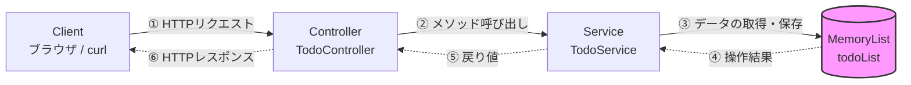

## 開発環境
- Java: 25
- Spring Boot: 4.0.2
- ビルドツール: Gradle
- Intellij IDEA: 2025.03

## ローカルでの起動コマンド
**Mac / Linux の場合**
```bash
./gradlew bootRun
```
**Windows の場合**
```bash
gradlew.bat bootRun
```

## 動作確認用のエンドポイント一覧
| HTTPメソッド | パス | 役割 |
| :--- | :--- | :--- |
| GET | `/health` | アプリケーションが正常に稼働しているか（ヘルスチェック）を確認する |
| GET | `/todos` | 現在登録されているTodoの一覧（リスト）を取得する |

### W5-D1課題: READMEにレイヤードアーキテクチャの図を追加する

## アーキテクチャ構成とデータの流れ

本アプリケーションは、メンテナンス性・拡張性を考慮し、レイヤードアーキテクチャで構成されています。
現在はController / Serviceの2層構成で、W6以降でRepositoryを追加し3層構成に移行予定です。



### 各層の責務
- **Controller**: 外部からの通信の窓口です。HTTPリクエスト（JSONなど）を受け取り、Javaオブジェクトに変換してServiceに処理を依頼します。最終的にレスポンスを返却します。
- **Service**: 業務ロジック（ビジネスルール）を担当します。Controllerからの依頼を受け、データの加工や判断を行います。
- **Repository（W6以降で導入予定）**: データベースへのデータの保存・取得を担当します。現在はService内のメモリ（List）を保管庫として代用しています。

### 💡 補足：メソッドによる通信の違い（POST / GET）
上記の図の **②（メソッド呼び出し）** と **⑤（戻り値）** において、リクエストの種類によって扱うデータが以下のように異なります。

- **登録時（POST `/todos`）**
  - **② 渡すもの**: JSONから取り出した登録用の文字列（`CreateTodoRequest` の `title`）
  - **⑤ 返るもの**: 「〜を登録しました」というメッセージの文字列（`String`）
- **一覧取得時（GET `/todos`）**
  - **② 渡すもの**: なし（全件取得のメソッドを引数なしで呼び出すのみ）
  - **⑤ 返るもの**: 現在登録されているすべてのTodoのリスト（`List<String>`）

### 23. W4: Gradle基盤整備・Mockitoテスト・GitHub Actions CI構築

- **日付**: 2026/02/18
- **ファイル**: [build.gradle](build.gradle), [TodoService.java](src/main/java/com/example/todo_api_v2/service/TodoService.java), [TodoController.java](src/main/java/com/example/todo_api_v2/controller/TodoController.java), [TodoControllerTest.java](src/test/java/com/example/todo_api_v2/controller/TodoControllerTest.java), [ci.yml](.github/workflows/ci.yml)
- **学習内容**:
  - `todo-api-v2`プロジェクトをSpring Initializrで新規作成、GitHubにpush
  - `build.gradle`の各依存関係（implementation/testImplementation）の役割を理解
  - `TodoService`・`TodoController`を一から実装（`@Service`・`@RestController`・`@PostMapping`）
  - Mockitoで`@Mock`/`@InjectMocks`を使ったControllerの単体テストを実装
  - GitHub Actionsで`ci.yml`を作成、mainへのpush時に自動テストが走るCIを構築

### 24. W5: Spring Boot REST API基礎（ヘルスチェック・Todo一覧）

- **日付**: 2026/02/19
- **ファイル**: [HealthController.java](src/main/java/com/example/todo_api_v2/controller/HealthController.java), [TodoController.java](src/main/java/com/example/todo_api_v2/controller/TodoController.java), [TodoService.java](src/main/java/com/example/todo_api_v2/service/TodoService.java), [README.md](README.md)
- **学習内容**:
  - `HealthController` を新規作成し、`GET /health` エンドポイントを実装（`ResponseEntity<String>`で200+"ok"を返す）
  - `TodoService` に `findAll()` を追加、`TodoController` に `GET /todos` を追加してダミーデータを返す一覧取得を実装
  - Controller/Service/Repositoryの責務分割を言語化（変更の影響範囲を閉じ込める設計意図まで）
  - READMEに開発環境・起動手順（Mac/Windows両対応）・エンドポイント一覧を記載

### 25. W5-D1: READMEにレイヤードアーキテクチャの図を追加
- **日付**: 2026/02/19
- **ファイル**: [README.md](README.md)
- **学習内容**:
  - Mermaid記法でController → Service → Memoryの流れを図で表現
  - 各層の責務（Controller/Service/Repository）を1文ずつ言語化
  - RepositoryはW6以降導入予定である旨を明記
  - POSTとGETでControllerからServiceへ渡すものが異なることを補足として記載

### 26. W5-D2: POSTに@RequestBodyを導入
- **日付**: 2026/02/19
- **ファイル**: [controller/TodoController.java](src/main/java/com/example/todo_api_v2/controller/TodoController.java)
- **学習内容**:
  - @RequestBodyなしではJSONボディが読み取れずnullになることを実験で確認
  - クエリパラメータとリクエストボディの違いを理解
  - CreateTodoRequestをrecordで定義し@RequestBodyで受け取る実装に修正
  - ブランチを切ってから作業する運用を実践

### 27. W6: Todo CRUD（H2）開始 - Entity / Repository / DTO / POST・GET実装

- **日付**: 2026/02/22
- **ファイル**: [entity/Todo.java](src/main/java/com/example/todo_api_v2/entity/Todo.java), [repository/TodoRepository.java](src/main/java/com/example/todo_api_v2/repository/TodoRepository.java), [dto/TodoCreateRequest.java](src/main/java/com/example/todo_api_v2/dto/TodoCreateRequest.java), [dto/TodoResponse.java](src/main/java/com/example/todo_api_v2/dto/TodoResponse.java), [service/TodoService.java](src/main/java/com/example/todo_api_v2/service/TodoService.java), [controller/TodoController.java](src/main/java/com/example/todo_api_v2/controller/TodoController.java), [build.gradle](build.gradle), [application.properties](src/main/resources/application.properties)
- **学習内容**:
  - RESTエンドポイント設計（メソッド/パス/ステータスコード）を自分で考えて言語化
  - `@Entity` / `@Id` / `@GeneratedValue`でTodoエンティティを実装
  - `JpaRepository<Todo, Long>`を継承したRepositoryインターフェースを作成
  - DTOを入力用（TodoCreateRequest）と出力用（TodoResponse）に分けた設計意図を理解
  - `save()`の戻り値を使わないとIDが取れない理由を理解して修正
  - POST（201）/ GET（200）の動作確認をPowerShellで実施

---
Last Updated: 2026/02/19
