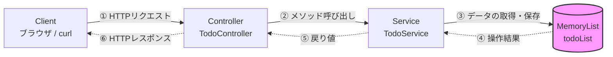

# Todo API v2


## 開発環境
- Java: 25
- Spring Boot: 4.0.2
- ビルドツール: Gradle
- Intellij IDEA: 2025.03

## ローカルでの起動コマンド
**Mac / Linux の場合**
```bash
./gradlew bootRun
```
**Windows の場合**
```bash
gradlew.bat bootRun
```

## 動作確認用のエンドポイント一覧
| HTTPメソッド | パス | 役割 |
| :--- | :--- | :--- |
| GET | `/health` | アプリケーションが正常に稼働しているか（ヘルスチェック）を確認する |
| GET | `/todos` | 現在登録されているTodoの一覧（リスト）を取得する |

### W5-D1課題: READMEにレイヤードアーキテクチャの図を追加する

## アーキテクチャ構成とデータの流れ

本アプリケーションは、メンテナンス性・拡張性を考慮し、レイヤードアーキテクチャで構成されています。
現在はController / Serviceの2層構成で、W6以降でRepositoryを追加し3層構成に移行予定です。


```mermaid
graph LR
    %% ノードの定義
    Client[Client<br/>ブラウザ / curl]
    Controller[Controller<br/>TodoController]
    Service[Service<br/>TodoService]
    Memory[(MemoryList<br/>todoList)]

    %% リクエスト（行き）の流れ
    Client -->|① HTTPリクエスト| Controller
    Controller -->|② メソッド呼び出し| Service
    Service -->|③ データの取得・保存| Memory

    %% レスポンス（帰り）の流れ
    Memory -.->|④ 操作結果| Service
    Service -.->|⑤ 戻り値| Controller
    Controller -.->|⑥ HTTPレスポンス| Client

    %% スタイルの設定
    style Memory fill:#f9f,stroke:#333,stroke-width:2px
```

### 各層の責務
- **Controller**: 外部からの通信の窓口です。HTTPリクエスト（JSONなど）を受け取り、Javaオブジェクトに変換してServiceに処理を依頼します。最終的にレスポンスを返却します。
- **Service**: 業務ロジック（ビジネスルール）を担当します。Controllerからの依頼を受け、データの加工や判断を行います。
- **Repository（W6以降で導入予定）**: データベースへのデータの保存・取得を担当します。現在はService内のメモリ（List）を保管庫として代用しています。

### 💡 補足：メソッドによる通信の違い（POST / GET）
上記の図の **②（メソッド呼び出し）** と **⑤（戻り値）** において、リクエストの種類によって扱うデータが以下のように異なります。

- **登録時（POST `/todos`）**
  - **② 渡すもの**: JSONから取り出した登録用の文字列（`CreateTodoRequest` の `title`）
  - **⑤ 返るもの**: 「〜を登録しました」というメッセージの文字列（`String`）
- **一覧取得時（GET `/todos`）**
  - **② 渡すもの**: なし（全件取得のメソッドを引数なしで呼び出すのみ）
  - **⑤ 返るもの**: 現在登録されているすべてのTodoのリスト（`List<String>`）

## 🔐 認可（アクセス制御）の設計方針(W10時点)

本APIにおけるエンドポイントのアクセス制御は、以下の設計方針に基づき実装しています。

**1. 未認証ユーザーのアクセスを全面禁止（401）**

本APIは「個人のタスク管理」を目的としたTodoツールであり、第三者へのデータ公開を想定していません。
将来的なリソースベース認可（自分のTodoだけを操作できる仕組み）の実装を見据え、全エンドポイントでログイン（認証）を必須としています。

**2. DELETE操作をADMIN権限に限定（403）**

現在のフェーズ（ロールベース認可のみの実装段階）では、一般ユーザー（USER）に削除権限を与えると「他人のTodoまで削除できてしまう」データロストの危険性があります。
そのため、破壊的操作（DELETE）は管理者（ADMIN）のみに制限しています。

※ 更新操作（PUT/PATCH）も他人のデータを操作し得ますが、Todo管理の核となる機能でありデータ自体は消失しないため、暫定的にUSERにも許可するトレードオフの判断をしています。

**今後の展望：** リソースベース認可（自分のTodoのみ操作可能）を実装した段階で、USERにもDELETE権限を開放する予定です。

### エンドポイント × ロール 認可マトリックス

| ユーザーの状態 | GET (取得) | POST / PUT / PATCH (作成/更新) | DELETE (削除) |
|---|---|---|---|
| 未認証 (ログインなし) | ❌ 401 Unauthorized | ❌ 401 Unauthorized | ❌ 401 Unauthorized |
| USER (一般権限) | ⭕️ 通過 | ⭕️ 通過 | ❌ 403 Forbidden |
| ADMIN (管理者権限) | ⭕️ 通過 | ⭕️ 通過 | ⭕️ 通過 |

## ⚠️ エラーレスポンス仕様

本APIにおいてエラーが発生した場合は、フロントエンド側でエラーハンドリングを行いやすいよう、以下の統一されたJSONフォーマットでレスポンスを返却します。

### レスポンス項目の説明
| 項目名 | 型 | 説明 |
|---|---|---|
| `statusCode` | Integer | HTTPステータスコード |
| `message` | String | エラーの全体的な概要・理由 |
| `errors` | Array | 発生したエラーの詳細リスト（エラーがない場合は空の配列 `[]`） |
| `errors[].field` | String | エラーが発生した対象の項目名（バリデーションエラー時） |
| `errors[].message` | String | 個別のエラー詳細メッセージ（バリデーションエラー時） |

---

### 1. バリデーションエラー（400 Bad Request）
リクエストの入力値に不正がある場合（必須項目の未入力、文字数オーバーなど）に返却されます。複数の入力エラーがある場合は、`errors` 配列内に複数格納されます。

**レスポンス例：**
```json
{
  "statusCode": 400,
  "message": "入力が不正です。",
  "errors": [
    {
      "field": "title",
      "message": "タイトルを入力してください"
    }
  ]
}

### 2. リソース非存在エラー（404 Not Found）
指定されたIDのTodoが存在しない場合など、対象のデータが見つからない場合に返却されます。この場合、個別の入力項目エラーではないため `errors` は空の配列となります。

**レスポンス例：**
```json
{
  "statusCode": 404,
  "message": "Todoが見つかりません。",
  "errors": []
}
```
---

## 🛠️ 品質チェック・テスト実行手順

このプロジェクトでは、コードの品質を保つためにCheckstyleとSpotBugsを導入しています。
開発を行う際は、コミット前にローカルで以下のコマンドを実行し、すべてのチェックを通過することを確認してください。

### 1. 静的解析（コーディング規約・潜在バグチェック）
```bash
# Checkstyle (コーディング規約違反のチェック)
./gradlew checkstyleMain checkstyleTest

# SpotBugs (潜在的なバグのチェック ※テストコードは対象外)
./gradlew spotbugsMain
```
*※ SpotBugsのレポートは `build/reports/spotbugs/main.html` に出力されます。*

### 2. テストの実行とカバレッジ確認
```bash
# 単体テスト・統合テストの実行
./gradlew test

# カバレッジレポートの出力
./gradlew jacocoTestReport
```
*※ カバレッジレポートは `build/reports/jacoco/test/html/index.html` に出力されます。*

---

### 23. W4: Gradle基盤整備・Mockitoテスト・GitHub Actions CI構築

- **日付**: 2026/02/18
- **ファイル**: [build.gradle](build.gradle), [TodoService.java](src/main/java/com/example/todo_api_v2/service/TodoService.java), [TodoController.java](src/main/java/com/example/todo_api_v2/controller/TodoController.java), [TodoControllerTest.java](src/test/java/com/example/todo_api_v2/controller/TodoControllerTest.java), [ci.yml](.github/workflows/ci.yml)
- **学習内容**:
  - `todo-api-v2`プロジェクトをSpring Initializrで新規作成、GitHubにpush
  - `build.gradle`の各依存関係（implementation/testImplementation）の役割を理解
  - `TodoService`・`TodoController`を一から実装（`@Service`・`@RestController`・`@PostMapping`）
  - Mockitoで`@Mock`/`@InjectMocks`を使ったControllerの単体テストを実装
  - GitHub Actionsで`ci.yml`を作成、mainへのpush時に自動テストが走るCIを構築

### 24. W5: Spring Boot REST API基礎（ヘルスチェック・Todo一覧）

- **日付**: 2026/02/19
- **ファイル**: [HealthController.java](src/main/java/com/example/todo_api_v2/controller/HealthController.java), [TodoController.java](src/main/java/com/example/todo_api_v2/controller/TodoController.java), [TodoService.java](src/main/java/com/example/todo_api_v2/service/TodoService.java), [README.md](README.md)
- **学習内容**:
  - `HealthController` を新規作成し、`GET /health` エンドポイントを実装（`ResponseEntity<String>`で200+"ok"を返す）
  - `TodoService` に `findAll()` を追加、`TodoController` に `GET /todos` を追加してダミーデータを返す一覧取得を実装
  - Controller/Service/Repositoryの責務分割を言語化（変更の影響範囲を閉じ込める設計意図まで）
  - READMEに開発環境・起動手順（Mac/Windows両対応）・エンドポイント一覧を記載

### 25. W5-D1: READMEにレイヤードアーキテクチャの図を追加
- **日付**: 2026/02/19
- **ファイル**: [README.md](README.md)
- **学習内容**:
  - Mermaid記法でController → Service → Memoryの流れを図で表現
  - 各層の責務（Controller/Service/Repository）を1文ずつ言語化
  - RepositoryはW6以降導入予定である旨を明記
  - POSTとGETでControllerからServiceへ渡すものが異なることを補足として記載

### 26. W5-D2: POSTに@RequestBodyを導入
- **日付**: 2026/02/19
- **ファイル**: [controller/TodoController.java](src/main/java/com/example/todo_api_v2/controller/TodoController.java)
- **学習内容**:
  - @RequestBodyなしではJSONボディが読み取れずnullになることを実験で確認
  - クエリパラメータとリクエストボディの違いを理解
  - CreateTodoRequestをrecordで定義し@RequestBodyで受け取る実装に修正
  - ブランチを切ってから作業する運用を実践

### 27. W6: Todo CRUD（H2）開始 - Entity / Repository / DTO / POST・GET実装

- **日付**: 2026/02/22
- **ファイル**: [entity/Todo.java](src/main/java/com/example/todo_api_v2/entity/Todo.java), [repository/TodoRepository.java](src/main/java/com/example/todo_api_v2/repository/TodoRepository.java), [dto/TodoCreateRequest.java](src/main/java/com/example/todo_api_v2/dto/TodoCreateRequest.java), [dto/TodoResponse.java](src/main/java/com/example/todo_api_v2/dto/TodoResponse.java), [service/TodoService.java](src/main/java/com/example/todo_api_v2/service/TodoService.java), [controller/TodoController.java](src/main/java/com/example/todo_api_v2/controller/TodoController.java), [build.gradle](build.gradle), [application.properties](src/main/resources/application.properties)
- **学習内容**:
  - RESTエンドポイント設計（メソッド/パス/ステータスコード）を自分で考えて言語化
  - `@Entity` / `@Id` / `@GeneratedValue`でTodoエンティティを実装
  - `JpaRepository<Todo, Long>`を継承したRepositoryインターフェースを作成
  - DTOを入力用（TodoCreateRequest）と出力用（TodoResponse）に分けた設計意図を理解
  - `save()`の戻り値を使わないとIDが取れない理由を理解して修正
  - POST（201）/ GET（200）の動作確認をPowerShellで実施

### 28. W6: findById実装 - 詳細取得エンドポイント追加

- **日付**: 2026/02/24
- **ファイル**: [service/TodoService.java](src/main/java/com/example/todo_api_v2/service/TodoService.java), [controller/TodoController.java](src/main/java/com/example/todo_api_v2/controller/TodoController.java)
- **学習内容**:
  - `JpaRepository.findById()`の戻り値が`Optional`であることを理解
  - `orElseThrow()`で存在しないIDの場合に`NoSuchElementException`を投げる実装
  - `@PathVariable`でURLの`{id}`を受け取る方法
  - `try-catch`で`NoSuchElementException`を404に変換する実装
  - `long`と`Long`の違い（プリミティブ型とラッパークラス）

### 29. W6: Todo CRUD完成 - 更新・削除・エラーレスポンス統一

- **日付**: 2026/02/26
- **ファイル**: [dto/TodoUpdateRequest.java](src/main/java/com/example/todo_api_v2/dto/TodoUpdateRequest.java), [dto/ErrorResponse.java](src/main/java/com/example/todo_api_v2/dto/ErrorResponse.java), [service/TodoService.java](src/main/java/com/example/todo_api_v2/service/TodoService.java), [controller/TodoController.java](src/main/java/com/example/todo_api_v2/controller/TodoController.java)
- **学習内容**:
  - 更新用DTO（TodoUpdateRequest）を入力用・出力用と分けて設計
  - `updateTodo` / `deleteTodo`をServiceに実装（save()の戻り値を使う理由を理解）
  - `@PutMapping` / `@DeleteMapping`でエンドポイントを追加
  - `ResponseEntity<?>`で成功時と失敗時に異なる型を返す方法を理解
  - ErrorResponseを作成し、404エラー時にメッセージを返す形式に統一
  - PowerShellで全エンドポイントの動作確認（POST/GET/PUT/DELETE/404）

### 30. W7: MyBatis導入・JPA→MyBatis切替・CRUD動作確認

- **日付**: 2026/02/28
- **ファイル**: [build.gradle](build.gradle), [application.properties](src/main/resources/application.properties), [schema.sql](src/main/resources/schema.sql), [mapper/TodoMapper.java](src/main/java/com/example/todo_api_v2/mapper/TodoMapper.java), [service/TodoService.java](src/main/java/com/example/todo_api_v2/service/TodoService.java), [entity/Todo.java](src/main/java/com/example/todo_api_v2/entity/Todo.java)
- **学習内容**:
  - `spring-boot-starter-data-jpa` を削除し `mybatis-spring-boot-starter:4.0.0` に切替
  - `schema.sql` でCREATE TABLE文を手書き（MyBatisはテーブル自動生成がないため）
  - `@Mapper` / `@Select` / `@Insert` / `@Update` / `@Delete` でSQLをアノテーションで記述
  - `@Options(useGeneratedKeys = true, keyProperty = "id")` でDB自動採番したidをJavaに反映
  - `mybatis.configuration.map-underscore-to-camel-case=true` でスネークケース⇔キャメルケースを自動変換
  - `Todo.java` からJPAアノテーション（`@Entity` / `@Id` / `@GeneratedValue`）を削除しPOJOに変更
  - `setId()` を追加した理由：MyBatisがSELECT結果をJavaに詰める際にSetterを使うため
  - CRUD全エンドポイントの動作確認（POST/GET/PUT/DELETE/404）完了

### 31. W7: キーワード検索実装・W7 DoD完了

- **日付**: 2026/03/01
- **ファイル**: [mapper/TodoMapper.java](src/main/java/com/example/todo_api_v2/mapper/TodoMapper.java), [service/TodoService.java](src/main/java/com/example/todo_api_v2/service/TodoService.java), [controller/TodoController.java](src/main/java/com/example/todo_api_v2/controller/TodoController.java)
- **学習内容**:
  - `CONCAT('%', #{keyword}, '%')` でLIKE部分一致検索を実装（`'%#{keyword}%'` はNG）
  - `@RequestParam(required = false)` でキーワード省略時は全件取得に切り替える設計
  - `GET /todos` と `GET /todos?keyword=xxx` を1つのエンドポイントに統合
  - W7 DoD（MyBatis切替 / DDL / 検索 / README）完全完了
  - W7 Q1 JPAではなくMyBatisを選んだ理由
  　JPAではテーブルやRepository(インターフェイス)、Entityなど、自動実装される部分が多い。
  　SQLの操作をより細かくしたい場合の自由度が高いMyBatisを選択した。
  - W7 Q2 CONCAT('%', #{keyword}, '%') という書き方にした理由
  　 #{keyword}はプリペアドステートメントとして値をバインドするため、
    '%#{keyword}%'と書くと'%'keyword'%'と解釈されSQL構文エラーになる。
    CONCATで%と切り離してバインドすることで正しくLIKE検索ができる。
  - W7 Q3 map-underscore-to-camel-case=true を設定した理由
    Java言語では変数やフィールドはキャメルケース(区切りが大文字)で書かれているのに対して、SQLではカラム名はスネークケースが一般的。
    この命名規則による不一致をなくすために、スネークケースをキャメルケースに変換するから。

### 32. W8: Bean Validation導入・バリデーション制約の追加

- **日付**: 2026/03/03
- **ファイル**: [build.gradle](build.gradle), [dto/TodoCreateRequest.java](src/main/java/com/example/todo_api_v2/dto/TodoCreateRequest.java), [dto/ErrorResponse.java](src/main/java/com/example/todo_api_v2/dto/ErrorResponse.java), [dto/ValidationError.java](src/main/java/com/example/todo_api_v2/dto/ValidationError.java), [controller/TodoController.java](src/main/java/com/example/todo_api_v2/controller/TodoController.java)
- **学習内容**:
  - `spring-boot-starter-validation` を依存に追加しBean Validationを導入
  - `@NotBlank` / `@Size(max=255)` で `title` に空白禁止・文字数上限の制約を設定
  - `@Validated` をControllerの引数に付与してバリデーションを有効化
  - `ErrorResponse` にバリデーションエラー詳細を返す `List<ValidationError>` を追加（後方互換の補助コンストラクタ付き）
  - Springデフォルトのエラーレスポンスでは原因が不明瞭である問題を確認 → 次回 `@ControllerAdvice` で統一予定

### 33. W8: @ControllerAdvice導入・例外ハンドリング統一・統合テスト

- **日付**: 2026/03/06
- **ファイル**: [exception/GlobalExceptionHandler.java](src/main/java/com/example/todo_api_v2/exception/GlobalExceptionHandler.java), [dto/ErrorResponse.java](src/main/java/com/example/todo_api_v2/dto/ErrorResponse.java), [dto/ValidationError.java](src/main/java/com/example/todo_api_v2/dto/ValidationError.java), [dto/TodoCreateRequest.java](src/main/java/com/example/todo_api_v2/dto/TodoCreateRequest.java), [dto/TodoUpdateRequest.java](src/main/java/com/example/todo_api_v2/dto/TodoUpdateRequest.java), [controller/TodoController.java](src/main/java/com/example/todo_api_v2/controller/TodoController.java), [controller/TodoControllerTest.java](src/test/java/com/example/todo_api_v2/controller/TodoControllerTest.java), [build.gradle](build.gradle)
- **学習内容**:
  - `@RestControllerAdvice` + `@ExceptionHandler` で `MethodArgumentNotValidException` と `NoSuchElementException` を一元管理
  - Controllerから `try-catch` を除去し、`ResponseEntity<?>` → `ResponseEntity<TodoResponse>` に型を明確化
  - `@NotBlank(message="...")` でバリデーションメッセージをカスタマイズ
  - `ErrorResponse` の補助コンストラクタで errors を空リストに変更（クライアント側のnullチェック不要化）
  - `@SpringBootTest` + `@AutoConfigureMockMvc` で統合テスト2本（404/400）を実装

### 34. W8: 異常系統合テスト追加・エラーレスポンス仕様をREADMEに記載・W8 DoD完了

- **日付**: 2026/03/08
- **ファイル**: [controller/TodoControllerTest.java](src/test/java/com/example/todo_api_v2/controller/TodoControllerTest.java), [README.md](README.md)
- **学習内容**:
  - `@SpringBootTest` + `@AutoConfigureMockMvc` で異常系統合テスト6本を実装（GET/PUT/DELETE 404、POST 空文字/空白/256文字 400）
  - `jsonPath` でネストしたJSON（`$.errors[0].field`）を個別に検証する手法を習得
  - DELETEリクエストにリクエストボディは不要であることを理解
  - READMEにエラーレスポンス仕様（項目説明テーブル + 400/404のJSON例）を追記
  - W8 DoD（Bean Validation / @ControllerAdvice / 統合テスト2本以上 / README記載）全完了

### 35. W9: 状態遷移の設計判断・TodoStatus enum・changeStatusメソッド初版

- **日付**: 2026/03/09
- **ファイル**: [entity/TodoStatus.java](src/main/java/com/example/todo_api_v2/entity/TodoStatus.java), [entity/Todo.java](src/main/java/com/example/todo_api_v2/entity/Todo.java), [exception/InvalidStatusTransitionException.java](src/main/java/com/example/todo_api_v2/exception/InvalidStatusTransitionException.java)
- **学習内容**:
  - `isCompleted`（Boolean）→ `TodoStatus`（enum: TODO/DOING/DONE）への拡張設計
  - 状態遷移ルールを全9パターン洗い出し、許可/禁止を業務観点で判断（Done→Todoは禁止、2ステップでの戻りは許容）
  - 遷移ロジックをEntityに持たせる設計判断（「自分の状態を知っているのは自分自身」）
  - `setStatus`を廃止し`changeStatus`メソッド経由でのみ状態変更可能にする設計
  - 独自例外`InvalidStatusTransitionException`（extends IllegalStateException）を作成
  - レビュー指摘：遷移ルールをenumにデータとして持たせるリファクタ、completedAt操作の分離、getter戻り値のOptional再検討が次回の課題

### 36. W9: 状態遷移の実装 - TodoStatus enum リファクタ・全レイヤー改修・PATCHエンドポイント追加

- **日付**: 2026/03/13
- **ファイル**: [entity/TodoStatus.java](src/main/java/com/example/todo_api_v2/entity/TodoStatus.java), [entity/Todo.java](src/main/java/com/example/todo_api_v2/entity/Todo.java), [exception/InvalidStatusTransitionException.java](src/main/java/com/example/todo_api_v2/exception/InvalidStatusTransitionException.java), [exception/GlobalExceptionHandler.java](src/main/java/com/example/todo_api_v2/exception/GlobalExceptionHandler.java), [dto/TodoResponse.java](src/main/java/com/example/todo_api_v2/dto/TodoResponse.java), [dto/TodoUpdateRequest.java](src/main/java/com/example/todo_api_v2/dto/TodoUpdateRequest.java), [dto/TodoStatusUpdateRequest.java](src/main/java/com/example/todo_api_v2/dto/TodoStatusUpdateRequest.java), [mapper/TodoMapper.java](src/main/java/com/example/todo_api_v2/mapper/TodoMapper.java), [service/TodoService.java](src/main/java/com/example/todo_api_v2/service/TodoService.java), [controller/TodoController.java](src/main/java/com/example/todo_api_v2/controller/TodoController.java), [schema.sql](src/main/resources/schema.sql)
- **学習内容**:
  - TodoStatus enumに`canTransitionTo`メソッドを実装し、遷移ルールをデータとして表現
  - switch式の中で比較演算の結果（boolean）を直接返す書き方を習得
  - `changeStatus`をガード節でリファクタし、遷移判定と副作用（completedAt操作）を分離
  - getterの戻り値にOptionalを使わない判断（MyBatis/Jacksonとの相性を考慮）
  - schema.sqlでis_completed→todo_status(VARCHAR)+completed_at(TIMESTAMP)に変更
  - `PATCH /todos/{id}/status`エンドポイントを新設し、内容更新（PUT）と状態遷移（PATCH）を責務分離
  - TodoResponseへの詰め替えを`convertTodoResponse`としてprivateメソッドに抽出
  - InvalidStatusTransitionExceptionに409 Conflictを割り当て（業務ルール違反の表現）
  - `@PatchExchange`（HTTPクライアント用）と`@Update`（MyBatis用）の混同を修正

### 37. W9: 状態遷移のEntity単体テスト4件・統合テスト着手

- **日付**: 2026/03/14
- **ファイル**: [entity/TodoTest.java](src/test/java/com/example/todo_api_v2/entity/TodoTest.java), [controller/TodoControllerTest.java](src/test/java/com/example/todo_api_v2/controller/TodoControllerTest.java)
- **学習内容**:
  - Entity単体テスト4件作成（正常遷移・不正遷移・completedAt設定/クリア）
  - @BeforeEachで共通インスタンスを準備するテスト設計
  - 統合テストでPOSTレスポンスからidを取り出す手法（andReturn → getContentAsString → objectMapper.readValue）

### 38. W9: 一括status変更API（@Transactional）・Entity単体テスト4件・統合テスト4件

- **日付**: 2026/03/22
- **ファイル**: [dto/TodoBulkStatusUpdateRequest.java](src/main/java/com/example/todo_api_v2/dto/TodoBulkStatusUpdateRequest.java), [service/TodoService.java](src/main/java/com/example/todo_api_v2/service/TodoService.java), [controller/TodoController.java](src/main/java/com/example/todo_api_v2/controller/TodoController.java), [entity/TodoTest.java](src/test/java/com/example/todo_api_v2/entity/TodoTest.java), [controller/TodoControllerTest.java](src/test/java/com/example/todo_api_v2/controller/TodoControllerTest.java)
- **学習内容**:
  - Entity単体テスト4件（正常遷移・不正遷移・completedAt設定/クリア）
  - 統合テスト4件（PATCH正常遷移200・不正遷移409・一括正常200・一括ロールバック409）
  - `@Transactional(rollbackFor = Exception.class)`で非検査例外+検査例外の両方をロールバック対象に
  - テスト側の`@Transactional`とService側の`@Transactional`の干渉問題を理解し、ロールバック検証テストではテスト側の`@Transactional`を外す対応
  - `@AfterEach`+JdbcTemplateでテスト後のDB清掃・AUTO_INCREMENTリセット
  - `createTodoForTest`をprivateメソッドに抽出してテストコードのDRYを実現

### 39. W10: Role enum・Userエンティティ・usersテーブル設計

- **日付**: 2026/03/22
- **ファイル**: [entity/Role.java](src/main/java/com/example/todo_api_v2/entity/Role.java), [entity/User.java](src/main/java/com/example/todo_api_v2/entity/User.java), [schema.sql](src/main/resources/schema.sql)
- **学習内容**:
  - 認証（Authentication）と認可（Authorization）の違いを整理
  - `Role` enum（USER / ADMIN）を作成し、TodoStatusと同じ設計パターンを再利用
  - `User` エンティティ（id, email, role, passwordHash）を作成
  - `schema.sql` に `users` テーブルを追加（email UNIQUE制約・password_hash NOT NULL）
  - パスワード文字数制限はDB側ではなくJavaバリデーション層で行う判断（BCryptは固定60文字のため）

### 40. W10: UserMapper作成・Spring Security依存追加・デフォルト認証の体験

- **日付**: 2026/03/23
- **ファイル**: [mapper/UserMapper.java](src/main/java/com/example/todo_api_v2/mapper/UserMapper.java), [build.gradle](build.gradle)
- **学習内容**:
  - `UserMapper`を作成（`@Mapper` + `@Select`でemailからUser検索、戻り値は`Optional<User>`）
  - `spring-boot-starter-security`をbuild.gradleに追加
  - 依存追加だけで全エンドポイントにログイン必須のロックがかかることを体験（デフォルトで安全の設計思想）
  - schema.sqlの全角スペース混入によるSQL構文エラーを発見・修正

### 41. W10: SecurityConfig・CustomUserDetailsService・初期ユーザー登録・ロール別アクセス制御の動作確認

- **日付**: 2026/03/26
- **ファイル**: [config/SecurityConfig.java](src/main/java/com/example/todo_api_v2/config/SecurityConfig.java), [service/CustomUserDetailsService.java](src/main/java/com/example/todo_api_v2/service/CustomUserDetailsService.java), [data.sql](src/main/resources/data.sql)
- **学習内容**:
  - `SecurityConfig`でロール別アクセス制御を定義（DELETE=ADMINのみ、他=認証済み全員）
  - `CustomUserDetailsService`でUserDetailsServiceをimplements、DBからemailでユーザー検索→UserDetailsに詰め替え
  - `data.sql`に初期ユーザー2件（USER/ADMIN）をBCryptハッシュ付きで登録
  - curlで全パターン動作確認：未認証→401、USERでGET→200、USERでDELETE→403、ADMINでDELETE→404（認可通過）
  - `hasRole("ADMIN")`は内部的に`ROLE_ADMIN`を探す仕組みと、`.roles()`が自動で`ROLE_`を付ける整合性を理解

### 42. W10: セキュリティテスト追加・MockMvcとSpring Security統合修正・README認可設計方針記載・W10 DoD完了

- **日付**: 2026/03/30
- **ファイル**: [controller/TodoControllerTest.java](src/test/java/com/example/todo_api_v2/controller/TodoControllerTest.java), [README.md](README.md)
- **学習内容**:
  - `MockMvcBuilders.webAppContextSetup(context).apply(springSecurity())` でMockMvcとSpring Securityのフィルターチェーンを明示的に統合
  - `@WithMockUser(roles = "USER")` でUSERロールのDELETEが403 Forbiddenになるテストを追加
  - `@WithMockUser` なしで未認証GETが401 Unauthorizedになるテストを追加
  - READMEに認可設計方針（未認証禁止の理由・DELETE制限の理由・今後の展望）とアクセスマトリックス表を記載
  - W10 DoD（2ロール導入・保護エンドポイント制限・README認可図・セキュリティテスト）全完了

### 43. W11: TodoServiceユニットテスト3件追加（findById・createTodo）

- **日付**: 2026/03/31
- **ファイル**: [service/TodoServiceTest.java](src/test/java/com/example/todo_api_v2/service/TodoServiceTest.java)
- **学習内容**:
  - `@ExtendWith(MockitoExtension.class)` + `@Mock` / `@InjectMocks` でServiceレイヤーのユニットテストを構築
  - 統合テスト（MockMvcで全レイヤー通過）とユニットテスト（1クラスだけ切り出し）の違いを理解
  - `verify(todoMapper, times(1)).insert(any(Todo.class))` でMapperの呼び出し自体を検証する手法を習得

### 44. W11: TodoServiceユニットテスト7件追加（updateTodo・changeTodoStatus・deleteTodo）

- **日付**: 2026/04/01
- **ファイル**: [service/TodoServiceTest.java](src/test/java/com/example/todo_api_v2/service/TodoServiceTest.java)
- **学習内容**:
  - `updateTodo`の正常系（更新後のTodoResponse検証 + `verify`でupdate呼び出し確認）と異常系（ID不在でNoSuchElementException）
  - `changeTodoStatus`の正常系（TODO→DOING）と異常系2本（ID不在・不正遷移TODO→DONEでInvalidStatusTransitionException）
  - `deleteTodo`の正常系（`verify`でdelete呼び出し確認）と異常系（ID不在でNoSuchElementException）

### 45. W11: API統合テスト3件追加・テストピラミッド整理・W11 DoD大部分完了

- **日付**: 2026/04/07
- **ファイル**: [controller/TodoControllerTest.java](src/test/java/com/example/todo_api_v2/controller/TodoControllerTest.java)
- **学習内容**:
  - `findAll`正常系（2件登録→全件取得でlength・title・dueDateを検証）
  - `findByKeyword`ヒットあり（LIKE部分一致で2件抽出）・ヒットなし（空配列が返ること）の統合テスト
  - テストピラミッドの3層（ユニット・統合・E2E）の違いと、現状の課題（アイスクリームコーン型）をNotionとJavaまとめに整理

### 46. W11: JaCoCo導入・カバレッジ82%達成・W11 DoD全完了

- **日付**: 2026/04/08
- **ファイル**: [build.gradle](build.gradle)
- **学習内容**:
  - `build.gradle`に`id 'jacoco'`プラグインを追加
  - `./gradlew test jacocoTestReport`でカバレッジレポートを生成
  - 全体カバレッジ82%達成（Service 81%、Controller 75%、Entity 68%、DTO/Exception/Config 100%）

### 47. W12: Checkstyle・SpotBugs導入・CIワークフロー改修

- **日付**: 2026/04/08
- **ファイル**: [build.gradle](build.gradle), [config/checkstyle/checkstyle.xml](config/checkstyle/checkstyle.xml), [config/spotbugs/exclude.xml](config/spotbugs/exclude.xml), [.github/workflows/ci.yml](.github/workflows/ci.yml), [dto/ErrorResponse.java](src/main/java/com/example/todo_api_v2/dto/ErrorResponse.java), [dto/TodoBulkStatusUpdateRequest.java](src/main/java/com/example/todo_api_v2/dto/TodoBulkStatusUpdateRequest.java)
- **学習内容**:
  - Checkstyle（Google Checks v13.4.0）とSpotBugs（v6.4.8）をGradleプラグインとして導入
  - SpotBugsのEI/EI2警告に対し、recordのコンパクトコンストラクタで`List.copyOf()`による防御的コピーを実装
  - Spring DIのコンストラクタインジェクションによる誤検知はexclude.xmlで除外
  - CIワークフローをJava 25に更新し、checkstyleMain/checkstyleTest/spotbugsMainをCI実行対象に追加

### 48. W12: Branch Protection Rules・README品質チェック手順・CIバッジ・W12 DoD完了

- **日付**: 2026/04/09
- **ファイル**: [README.md](README.md), [.github/workflows/ci.yml](.github/workflows/ci.yml)
- **学習内容**:
  - GitHub Branch Protection Rules設定（main → PR必須 + CIパス必須 + Force push/Delete禁止）
  - READMEにCIバッジと品質チェック手順セクションを追加
  - SpotBugsをテストコードに適用しない理由を言語化（異常系テストやmock使用による誤検知）
  - W12 DoD全4項目完了（CI必須化・静的解析導入・README記載・CIバッジ）

### 49. W13: ログ方針策定・INFO/WARN/ERRORログ実装・Spring Profile分離・W13 DoD完了

- **日付**: 2026/04/10
- **ファイル**: [service/TodoService.java](src/main/java/com/example/todo_api_v2/service/TodoService.java), [exception/GlobalExceptionHandler.java](src/main/java/com/example/todo_api_v2/exception/GlobalExceptionHandler.java), [application.yml](src/main/resources/application.yml), [application-dev.yml](src/main/resources/application-dev.yml), [application-prod.yml](src/main/resources/application-prod.yml)
- **学習内容**:
  - ログレベルの使い分け方針を策定（INFO=DB変更系の正常完了、WARN=クライアント起因エラー、ERROR=サーバー起因エラー、DEBUG=GETなど副作用なし）
  - TodoServiceの全更新系メソッドにINFOログ追加、SecurityContextHolderからユーザー情報を取得するgetCurrentUsername()をprivateメソッドに切り出し
  - GlobalExceptionHandlerに3種のWARNログと汎用Exception.classハンドラ（ERRORログ+スタックトレース付き、セキュリティのためエラー詳細は非公開）を追加
  - Spring Profileでapplication.ymlを共通/dev/prodに分離、環境変数による本番切替の運用方針を理解

---
Last Updated: 2026/04/10
