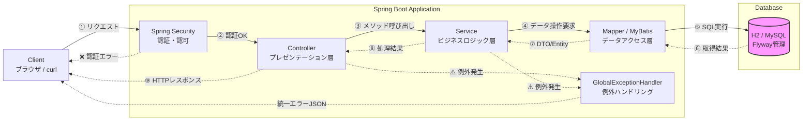
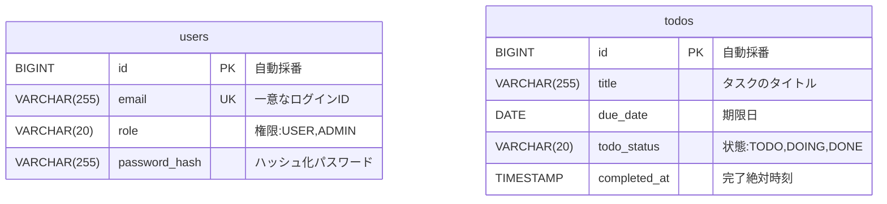

# Todo API v2


## 開発環境
- Java: 25
- Spring Boot: 4.0.2
- ビルドツール: Gradle
- Intellij IDEA: 2025.03

## ローカルでの起動コマンド
**Mac / Linux の場合**
```bash
./gradlew bootRun
```
**Windows の場合**
```bash
gradlew.bat bootRun
```

## 動作確認用のエンドポイント一覧
| HTTPメソッド | パス | 役割 |
| :--- | :--- | :--- |
| GET | `/health` | アプリケーションが正常に稼働しているか（ヘルスチェック）を確認する |
| GET | `/todos` | 現在登録されているTodoの一覧（リスト）を取得する |

## 🏗️ アーキテクチャ構成とデータの流れ

本アプリケーションは、保守性と拡張性を高めるためにレイヤードアーキテクチャを採用しています。
初期のインメモリ構成から改修を行い、現在はSpring Securityを用いた認証・認可、MyBatisによるデータベースアクセス、および共通例外ハンドリングを備えた構成となっています。


```mermaid
graph LR
    %% ノードの定義
    Client[Client<br/>ブラウザ / curl]

    subgraph Spring Boot Application
        Security[Spring Security<br/>認証・認可]
        Controller[Controller<br/>プレゼンテーション層]
        Service[Service<br/>ビジネスロジック層]
        Mapper[Mapper / MyBatis<br/>データアクセス層]
        ExceptionHandler[GlobalExceptionHandler<br/>例外ハンドリング]
    end

    subgraph Database
        DB[(H2 / MySQL<br/>Flyway管理)]
    end

    %% 正常系の流れ
    Client -->|① リクエスト| Security
    Security -->|② 認証OK| Controller
    Controller -->|③ メソッド呼び出し| Service
    Service -->|④ データ操作要求| Mapper
    Mapper -->|⑤ SQL実行| DB

    DB -.->|⑥ 取得結果| Mapper
    Mapper -.->|⑦ DTO/Entity| Service
    Service -.->|⑧ 処理結果| Controller
    Controller -.->|⑨ HTTPレスポンス| Client

    %% 例外系の流れ
    Security -.->|❌ 認証エラー| Client
    Controller -.->|⚠️ 例外発生| ExceptionHandler
    Service -.->|⚠️ 例外発生| ExceptionHandler
    ExceptionHandler -.->|統一エラーJSON| Client

    %% スタイル
    style DB fill:#f9f,stroke:#333,stroke-width:2px
```

### 🏢 各層の役割

- **Spring Security (認証・認可)**
  - アプリケーションのアクセス制御を担います。すべてのリクエストをインターセプトし、未認証（401）や権限不足（403）の不正なアクセスをController到達前にブロックします。
- **Controller (プレゼンテーション層)**
  - クライアントからのHTTPリクエストを受け付け、入力値のバリデーションを行います。適切なServiceを呼び出し、処理結果をJSON形式のHTTPレスポンスとして返却します。
- **Service (ビジネスロジック層)**
  - アプリケーションのコアとなる処理を担当します。Todoの操作や権限の検証など、ドメイン固有のビジネスルールを実行し、必要に応じてMapperを呼び出します。
- **Mapper (データアクセス層 / MyBatis)**
  - データベースとの連携を担当します。Serviceからの要求に基づきMyBatis経由でSQLを実行し、取得したレコードをJavaオブジェクト（Entity/DTO）にマッピングします。
- **Database & Spring Profile**
  - 環境変数（`spring.profiles.active`）の指定により、開発環境（H2）と本番環境（MySQL）の接続先を切り替えます。DBのスキーマ構築および初期データ投入は、Flywayによってバージョン管理・自動化されています。
- **GlobalExceptionHandler (例外ハンドリング)**
  - アプリケーション内で発生した各種例外（Exception）を横断的に捕捉し、フロントエンド側で処理しやすい統一されたエラーレスポンスフォーマット（JSON）に変換して返却します。

## データベース設計(ER図)

本アプリケーションはデータベース構造は以下の通りです。
Flywayを導入し、データベースのマイグレーションを自動化しています。
Week14時点。今後はtodosにuser_idを追加して、外部キーとして繋げる。


```mermaid
erDiagram
    users{
         BIGINT id PK "自動採番"
         VARCHAR(255) email UK "一意なログインID"
         VARCHAR(20) role "権限:USER,ADMIN"
         VARCHAR(255) password_hash "ハッシュ化パスワード"
    }

    todos{
         BIGINT id PK "自動採番"
         VARCHAR(255) title "タスクのタイトル"
         DATE due_date "期限日"
         VARCHAR(20) todo_status "状態:TODO,DOING,DONE"
         TIMESTAMP completed_at "完了絶対時刻"
    }
```

## 🔐 認可（アクセス制御）の設計方針(W10時点)

本APIにおけるエンドポイントのアクセス制御は、以下の設計方針に基づき実装しています。

**1. 未認証ユーザーのアクセスを全面禁止（401）**

本APIは「個人のタスク管理」を目的としたTodoツールであり、第三者へのデータ公開を想定していません。
将来的なリソースベース認可（自分のTodoだけを操作できる仕組み）の実装を見据え、全エンドポイントでログイン（認証）を必須としています。

**2. DELETE操作をADMIN権限に限定（403）**

現在のフェーズ（ロールベース認可のみの実装段階）では、一般ユーザー（USER）に削除権限を与えると「他人のTodoまで削除できてしまう」データロストの危険性があります。
そのため、破壊的操作（DELETE）は管理者（ADMIN）のみに制限しています。

※ 更新操作（PUT/PATCH）も他人のデータを操作し得ますが、Todo管理の核となる機能でありデータ自体は消失しないため、暫定的にUSERにも許可するトレードオフの判断をしています。

**今後の展望：** リソースベース認可（自分のTodoのみ操作可能）を実装した段階で、USERにもDELETE権限を開放する予定です。

### エンドポイント × ロール 認可マトリックス

| ユーザーの状態 | GET (取得) | POST / PUT / PATCH (作成/更新) | DELETE (削除) |
|---|---|---|---|
| 未認証 (ログインなし) | ❌ 401 Unauthorized | ❌ 401 Unauthorized | ❌ 401 Unauthorized |
| USER (一般権限) | ⭕️ 通過 | ⭕️ 通過 | ❌ 403 Forbidden |
| ADMIN (管理者権限) | ⭕️ 通過 | ⭕️ 通過 | ⭕️ 通過 |

## ⚠️ エラーレスポンス仕様

本APIにおいてエラーが発生した場合は、フロントエンド側でエラーハンドリングを行いやすいよう、以下の統一されたJSONフォーマットでレスポンスを返却します。

### レスポンス項目の説明
| 項目名 | 型 | 説明 |
|---|---|---|
| `statusCode` | Integer | HTTPステータスコード |
| `message` | String | エラーの全体的な概要・理由 |
| `errors` | Array | 発生したエラーの詳細リスト（エラーがない場合は空の配列 `[]`） |
| `errors[].field` | String | エラーが発生した対象の項目名（バリデーションエラー時） |
| `errors[].message` | String | 個別のエラー詳細メッセージ（バリデーションエラー時） |

---

### 1. バリデーションエラー（400 Bad Request）
リクエストの入力値に不正がある場合（必須項目の未入力、文字数オーバーなど）に返却されます。複数の入力エラーがある場合は、`errors` 配列内に複数格納されます。

**レスポンス例：**
```json
{
  "statusCode": 400,
  "message": "入力が不正です。",
  "errors": [
    {
      "field": "title",
      "message": "タイトルを入力してください"
    }
  ]
}

### 2. リソース非存在エラー（404 Not Found）
指定されたIDのTodoが存在しない場合など、対象のデータが見つからない場合に返却されます。この場合、個別の入力項目エラーではないため `errors` は空の配列となります。

**レスポンス例：**
```json
{
  "statusCode": 404,
  "message": "Todoが見つかりません。",
  "errors": []
}
```
---

## 🛠️ 品質チェック・テスト実行手順

このプロジェクトでは、コードの品質を保つためにCheckstyleとSpotBugsを導入しています。
開発を行う際は、コミット前にローカルで以下のコマンドを実行し、すべてのチェックを通過することを確認してください。

### 1. 静的解析（コーディング規約・潜在バグチェック）
```bash
# Checkstyle (コーディング規約違反のチェック)
./gradlew checkstyleMain checkstyleTest

# SpotBugs (潜在的なバグのチェック ※テストコードは対象外)
./gradlew spotbugsMain
```
*※ SpotBugsのレポートは `build/reports/spotbugs/main.html` に出力されます。*

### 2. テストの実行とカバレッジ確認
```bash
# 単体テスト・統合テストの実行
./gradlew test

# カバレッジレポートの出力
./gradlew jacocoTestReport
```
*※ カバレッジレポートは `build/reports/jacoco/test/html/index.html` に出力されます。*

---

### 23. W4: Gradle基盤整備・Mockitoテスト・GitHub Actions CI構築

- **日付**: 2026/02/18
- **ファイル**: [build.gradle](build.gradle), [TodoService.java](src/main/java/com/example/todo_api_v2/service/TodoService.java), [TodoController.java](src/main/java/com/example/todo_api_v2/controller/TodoController.java), [TodoControllerTest.java](src/test/java/com/example/todo_api_v2/controller/TodoControllerTest.java), [ci.yml](.github/workflows/ci.yml)
- **学習内容**:
  - `todo-api-v2`プロジェクトをSpring Initializrで新規作成、GitHubにpush
  - `build.gradle`の各依存関係（implementation/testImplementation）の役割を理解
  - `TodoService`・`TodoController`を一から実装（`@Service`・`@RestController`・`@PostMapping`）
  - Mockitoで`@Mock`/`@InjectMocks`を使ったControllerの単体テストを実装
  - GitHub Actionsで`ci.yml`を作成、mainへのpush時に自動テストが走るCIを構築

### 24. W5: Spring Boot REST API基礎（ヘルスチェック・Todo一覧）

- **日付**: 2026/02/19
- **ファイル**: [HealthController.java](src/main/java/com/example/todo_api_v2/controller/HealthController.java), [TodoController.java](src/main/java/com/example/todo_api_v2/controller/TodoController.java), [TodoService.java](src/main/java/com/example/todo_api_v2/service/TodoService.java), [README.md](README.md)
- **学習内容**:
  - `HealthController` を新規作成し、`GET /health` エンドポイントを実装（`ResponseEntity<String>`で200+"ok"を返す）
  - `TodoService` に `findAll()` を追加、`TodoController` に `GET /todos` を追加してダミーデータを返す一覧取得を実装
  - Controller/Service/Repositoryの責務分割を言語化（変更の影響範囲を閉じ込める設計意図まで）
  - READMEに開発環境・起動手順（Mac/Windows両対応）・エンドポイント一覧を記載

### 25. W5-D1: READMEにレイヤードアーキテクチャの図を追加
- **日付**: 2026/02/19
- **ファイル**: [README.md](README.md)
- **学習内容**:
  - Mermaid記法でController → Service → Memoryの流れを図で表現
  - 各層の責務（Controller/Service/Repository）を1文ずつ言語化
  - RepositoryはW6以降導入予定である旨を明記
  - POSTとGETでControllerからServiceへ渡すものが異なることを補足として記載

### 26. W5-D2: POSTに@RequestBodyを導入
- **日付**: 2026/02/19
- **ファイル**: [controller/TodoController.java](src/main/java/com/example/todo_api_v2/controller/TodoController.java)
- **学習内容**:
  - @RequestBodyなしではJSONボディが読み取れずnullになることを実験で確認
  - クエリパラメータとリクエストボディの違いを理解
  - CreateTodoRequestをrecordで定義し@RequestBodyで受け取る実装に修正
  - ブランチを切ってから作業する運用を実践

### 27. W6: Todo CRUD（H2）開始 - Entity / Repository / DTO / POST・GET実装

- **日付**: 2026/02/22
- **ファイル**: [entity/Todo.java](src/main/java/com/example/todo_api_v2/entity/Todo.java), [repository/TodoRepository.java](src/main/java/com/example/todo_api_v2/repository/TodoRepository.java), [dto/TodoCreateRequest.java](src/main/java/com/example/todo_api_v2/dto/TodoCreateRequest.java), [dto/TodoResponse.java](src/main/java/com/example/todo_api_v2/dto/TodoResponse.java), [service/TodoService.java](src/main/java/com/example/todo_api_v2/service/TodoService.java), [controller/TodoController.java](src/main/java/com/example/todo_api_v2/controller/TodoController.java), [build.gradle](build.gradle), [application.properties](src/main/resources/application.properties)
- **学習内容**:
  - RESTエンドポイント設計（メソッド/パス/ステータスコード）を自分で考えて言語化
  - `@Entity` / `@Id` / `@GeneratedValue`でTodoエンティティを実装
  - `JpaRepository<Todo, Long>`を継承したRepositoryインターフェースを作成
  - DTOを入力用（TodoCreateRequest）と出力用（TodoResponse）に分けた設計意図を理解
  - `save()`の戻り値を使わないとIDが取れない理由を理解して修正
  - POST（201）/ GET（200）の動作確認をPowerShellで実施

### 28. W6: findById実装 - 詳細取得エンドポイント追加

- **日付**: 2026/02/24
- **ファイル**: [service/TodoService.java](src/main/java/com/example/todo_api_v2/service/TodoService.java), [controller/TodoController.java](src/main/java/com/example/todo_api_v2/controller/TodoController.java)
- **学習内容**:
  - `JpaRepository.findById()`の戻り値が`Optional`であることを理解
  - `orElseThrow()`で存在しないIDの場合に`NoSuchElementException`を投げる実装
  - `@PathVariable`でURLの`{id}`を受け取る方法
  - `try-catch`で`NoSuchElementException`を404に変換する実装
  - `long`と`Long`の違い（プリミティブ型とラッパークラス）

### 29. W6: Todo CRUD完成 - 更新・削除・エラーレスポンス統一

- **日付**: 2026/02/26
- **ファイル**: [dto/TodoUpdateRequest.java](src/main/java/com/example/todo_api_v2/dto/TodoUpdateRequest.java), [dto/ErrorResponse.java](src/main/java/com/example/todo_api_v2/dto/ErrorResponse.java), [service/TodoService.java](src/main/java/com/example/todo_api_v2/service/TodoService.java), [controller/TodoController.java](src/main/java/com/example/todo_api_v2/controller/TodoController.java)
- **学習内容**:
  - 更新用DTO（TodoUpdateRequest）を入力用・出力用と分けて設計
  - `updateTodo` / `deleteTodo`をServiceに実装（save()の戻り値を使う理由を理解）
  - `@PutMapping` / `@DeleteMapping`でエンドポイントを追加
  - `ResponseEntity<?>`で成功時と失敗時に異なる型を返す方法を理解
  - ErrorResponseを作成し、404エラー時にメッセージを返す形式に統一
  - PowerShellで全エンドポイントの動作確認（POST/GET/PUT/DELETE/404）

### 30. W7: MyBatis導入・JPA→MyBatis切替・CRUD動作確認

- **日付**: 2026/02/28
- **ファイル**: [build.gradle](build.gradle), [application.properties](src/main/resources/application.properties), [schema.sql](src/main/resources/schema.sql), [mapper/TodoMapper.java](src/main/java/com/example/todo_api_v2/mapper/TodoMapper.java), [service/TodoService.java](src/main/java/com/example/todo_api_v2/service/TodoService.java), [entity/Todo.java](src/main/java/com/example/todo_api_v2/entity/Todo.java)
- **学習内容**:
  - `spring-boot-starter-data-jpa` を削除し `mybatis-spring-boot-starter:4.0.0` に切替
  - `schema.sql` でCREATE TABLE文を手書き（MyBatisはテーブル自動生成がないため）
  - `@Mapper` / `@Select` / `@Insert` / `@Update` / `@Delete` でSQLをアノテーションで記述
  - `@Options(useGeneratedKeys = true, keyProperty = "id")` でDB自動採番したidをJavaに反映
  - `mybatis.configuration.map-underscore-to-camel-case=true` でスネークケース⇔キャメルケースを自動変換
  - `Todo.java` からJPAアノテーション（`@Entity` / `@Id` / `@GeneratedValue`）を削除しPOJOに変更
  - `setId()` を追加した理由：MyBatisがSELECT結果をJavaに詰める際にSetterを使うため
  - CRUD全エンドポイントの動作確認（POST/GET/PUT/DELETE/404）完了

### 31. W7: キーワード検索実装・W7 DoD完了

- **日付**: 2026/03/01
- **ファイル**: [mapper/TodoMapper.java](src/main/java/com/example/todo_api_v2/mapper/TodoMapper.java), [service/TodoService.java](src/main/java/com/example/todo_api_v2/service/TodoService.java), [controller/TodoController.java](src/main/java/com/example/todo_api_v2/controller/TodoController.java)
- **学習内容**:
  - `CONCAT('%', #{keyword}, '%')` でLIKE部分一致検索を実装（`'%#{keyword}%'` はNG）
  - `@RequestParam(required = false)` でキーワード省略時は全件取得に切り替える設計
  - `GET /todos` と `GET /todos?keyword=xxx` を1つのエンドポイントに統合
  - W7 DoD（MyBatis切替 / DDL / 検索 / README）完全完了
  - W7 Q1 JPAではなくMyBatisを選んだ理由
  　JPAではテーブルやRepository(インターフェイス)、Entityなど、自動実装される部分が多い。
  　SQLの操作をより細かくしたい場合の自由度が高いMyBatisを選択した。
  - W7 Q2 CONCAT('%', #{keyword}, '%') という書き方にした理由
  　 #{keyword}はプリペアドステートメントとして値をバインドするため、
    '%#{keyword}%'と書くと'%'keyword'%'と解釈されSQL構文エラーになる。
    CONCATで%と切り離してバインドすることで正しくLIKE検索ができる。
  - W7 Q3 map-underscore-to-camel-case=true を設定した理由
    Java言語では変数やフィールドはキャメルケース(区切りが大文字)で書かれているのに対して、SQLではカラム名はスネークケースが一般的。
    この命名規則による不一致をなくすために、スネークケースをキャメルケースに変換するから。

### 32. W8: Bean Validation導入・バリデーション制約の追加

- **日付**: 2026/03/03
- **ファイル**: [build.gradle](build.gradle), [dto/TodoCreateRequest.java](src/main/java/com/example/todo_api_v2/dto/TodoCreateRequest.java), [dto/ErrorResponse.java](src/main/java/com/example/todo_api_v2/dto/ErrorResponse.java), [dto/ValidationError.java](src/main/java/com/example/todo_api_v2/dto/ValidationError.java), [controller/TodoController.java](src/main/java/com/example/todo_api_v2/controller/TodoController.java)
- **学習内容**:
  - `spring-boot-starter-validation` を依存に追加しBean Validationを導入
  - `@NotBlank` / `@Size(max=255)` で `title` に空白禁止・文字数上限の制約を設定
  - `@Validated` をControllerの引数に付与してバリデーションを有効化
  - `ErrorResponse` にバリデーションエラー詳細を返す `List<ValidationError>` を追加（後方互換の補助コンストラクタ付き）
  - Springデフォルトのエラーレスポンスでは原因が不明瞭である問題を確認 → 次回 `@ControllerAdvice` で統一予定

### 33. W8: @ControllerAdvice導入・例外ハンドリング統一・統合テスト

- **日付**: 2026/03/06
- **ファイル**: [exception/GlobalExceptionHandler.java](src/main/java/com/example/todo_api_v2/exception/GlobalExceptionHandler.java), [dto/ErrorResponse.java](src/main/java/com/example/todo_api_v2/dto/ErrorResponse.java), [dto/ValidationError.java](src/main/java/com/example/todo_api_v2/dto/ValidationError.java), [dto/TodoCreateRequest.java](src/main/java/com/example/todo_api_v2/dto/TodoCreateRequest.java), [dto/TodoUpdateRequest.java](src/main/java/com/example/todo_api_v2/dto/TodoUpdateRequest.java), [controller/TodoController.java](src/main/java/com/example/todo_api_v2/controller/TodoController.java), [controller/TodoControllerTest.java](src/test/java/com/example/todo_api_v2/controller/TodoControllerTest.java), [build.gradle](build.gradle)
- **学習内容**:
  - `@RestControllerAdvice` + `@ExceptionHandler` で `MethodArgumentNotValidException` と `NoSuchElementException` を一元管理
  - Controllerから `try-catch` を除去し、`ResponseEntity<?>` → `ResponseEntity<TodoResponse>` に型を明確化
  - `@NotBlank(message="...")` でバリデーションメッセージをカスタマイズ
  - `ErrorResponse` の補助コンストラクタで errors を空リストに変更（クライアント側のnullチェック不要化）
  - `@SpringBootTest` + `@AutoConfigureMockMvc` で統合テスト2本（404/400）を実装

### 34. W8: 異常系統合テスト追加・エラーレスポンス仕様をREADMEに記載・W8 DoD完了

- **日付**: 2026/03/08
- **ファイル**: [controller/TodoControllerTest.java](src/test/java/com/example/todo_api_v2/controller/TodoControllerTest.java), [README.md](README.md)
- **学習内容**:
  - `@SpringBootTest` + `@AutoConfigureMockMvc` で異常系統合テスト6本を実装（GET/PUT/DELETE 404、POST 空文字/空白/256文字 400）
  - `jsonPath` でネストしたJSON（`$.errors[0].field`）を個別に検証する手法を習得
  - DELETEリクエストにリクエストボディは不要であることを理解
  - READMEにエラーレスポンス仕様（項目説明テーブル + 400/404のJSON例）を追記
  - W8 DoD（Bean Validation / @ControllerAdvice / 統合テスト2本以上 / README記載）全完了

### 35. W9: 状態遷移の設計判断・TodoStatus enum・changeStatusメソッド初版

- **日付**: 2026/03/09
- **ファイル**: [entity/TodoStatus.java](src/main/java/com/example/todo_api_v2/entity/TodoStatus.java), [entity/Todo.java](src/main/java/com/example/todo_api_v2/entity/Todo.java), [exception/InvalidStatusTransitionException.java](src/main/java/com/example/todo_api_v2/exception/InvalidStatusTransitionException.java)
- **学習内容**:
  - `isCompleted`（Boolean）→ `TodoStatus`（enum: TODO/DOING/DONE）への拡張設計
  - 状態遷移ルールを全9パターン洗い出し、許可/禁止を業務観点で判断（Done→Todoは禁止、2ステップでの戻りは許容）
  - 遷移ロジックをEntityに持たせる設計判断（「自分の状態を知っているのは自分自身」）
  - `setStatus`を廃止し`changeStatus`メソッド経由でのみ状態変更可能にする設計
  - 独自例外`InvalidStatusTransitionException`（extends IllegalStateException）を作成
  - レビュー指摘：遷移ルールをenumにデータとして持たせるリファクタ、completedAt操作の分離、getter戻り値のOptional再検討が次回の課題

### 36. W9: 状態遷移の実装 - TodoStatus enum リファクタ・全レイヤー改修・PATCHエンドポイント追加

- **日付**: 2026/03/13
- **ファイル**: [entity/TodoStatus.java](src/main/java/com/example/todo_api_v2/entity/TodoStatus.java), [entity/Todo.java](src/main/java/com/example/todo_api_v2/entity/Todo.java), [exception/InvalidStatusTransitionException.java](src/main/java/com/example/todo_api_v2/exception/InvalidStatusTransitionException.java), [exception/GlobalExceptionHandler.java](src/main/java/com/example/todo_api_v2/exception/GlobalExceptionHandler.java), [dto/TodoResponse.java](src/main/java/com/example/todo_api_v2/dto/TodoResponse.java), [dto/TodoUpdateRequest.java](src/main/java/com/example/todo_api_v2/dto/TodoUpdateRequest.java), [dto/TodoStatusUpdateRequest.java](src/main/java/com/example/todo_api_v2/dto/TodoStatusUpdateRequest.java), [mapper/TodoMapper.java](src/main/java/com/example/todo_api_v2/mapper/TodoMapper.java), [service/TodoService.java](src/main/java/com/example/todo_api_v2/service/TodoService.java), [controller/TodoController.java](src/main/java/com/example/todo_api_v2/controller/TodoController.java), [schema.sql](src/main/resources/schema.sql)
- **学習内容**:
  - TodoStatus enumに`canTransitionTo`メソッドを実装し、遷移ルールをデータとして表現
  - switch式の中で比較演算の結果（boolean）を直接返す書き方を習得
  - `changeStatus`をガード節でリファクタし、遷移判定と副作用（completedAt操作）を分離
  - getterの戻り値にOptionalを使わない判断（MyBatis/Jacksonとの相性を考慮）
  - schema.sqlでis_completed→todo_status(VARCHAR)+completed_at(TIMESTAMP)に変更
  - `PATCH /todos/{id}/status`エンドポイントを新設し、内容更新（PUT）と状態遷移（PATCH）を責務分離
  - TodoResponseへの詰め替えを`convertTodoResponse`としてprivateメソッドに抽出
  - InvalidStatusTransitionExceptionに409 Conflictを割り当て（業務ルール違反の表現）
  - `@PatchExchange`（HTTPクライアント用）と`@Update`（MyBatis用）の混同を修正

### 37. W9: 状態遷移のEntity単体テスト4件・統合テスト着手

- **日付**: 2026/03/14
- **ファイル**: [entity/TodoTest.java](src/test/java/com/example/todo_api_v2/entity/TodoTest.java), [controller/TodoControllerTest.java](src/test/java/com/example/todo_api_v2/controller/TodoControllerTest.java)
- **学習内容**:
  - Entity単体テスト4件作成（正常遷移・不正遷移・completedAt設定/クリア）
  - @BeforeEachで共通インスタンスを準備するテスト設計
  - 統合テストでPOSTレスポンスからidを取り出す手法（andReturn → getContentAsString → objectMapper.readValue）

### 38. W9: 一括status変更API（@Transactional）・Entity単体テスト4件・統合テスト4件

- **日付**: 2026/03/22
- **ファイル**: [dto/TodoBulkStatusUpdateRequest.java](src/main/java/com/example/todo_api_v2/dto/TodoBulkStatusUpdateRequest.java), [service/TodoService.java](src/main/java/com/example/todo_api_v2/service/TodoService.java), [controller/TodoController.java](src/main/java/com/example/todo_api_v2/controller/TodoController.java), [entity/TodoTest.java](src/test/java/com/example/todo_api_v2/entity/TodoTest.java), [controller/TodoControllerTest.java](src/test/java/com/example/todo_api_v2/controller/TodoControllerTest.java)
- **学習内容**:
  - Entity単体テスト4件（正常遷移・不正遷移・completedAt設定/クリア）
  - 統合テスト4件（PATCH正常遷移200・不正遷移409・一括正常200・一括ロールバック409）
  - `@Transactional(rollbackFor = Exception.class)`で非検査例外+検査例外の両方をロールバック対象に
  - テスト側の`@Transactional`とService側の`@Transactional`の干渉問題を理解し、ロールバック検証テストではテスト側の`@Transactional`を外す対応
  - `@AfterEach`+JdbcTemplateでテスト後のDB清掃・AUTO_INCREMENTリセット
  - `createTodoForTest`をprivateメソッドに抽出してテストコードのDRYを実現

### 39. W10: Role enum・Userエンティティ・usersテーブル設計

- **日付**: 2026/03/22
- **ファイル**: [entity/Role.java](src/main/java/com/example/todo_api_v2/entity/Role.java), [entity/User.java](src/main/java/com/example/todo_api_v2/entity/User.java), [schema.sql](src/main/resources/schema.sql)
- **学習内容**:
  - 認証（Authentication）と認可（Authorization）の違いを整理
  - `Role` enum（USER / ADMIN）を作成し、TodoStatusと同じ設計パターンを再利用
  - `User` エンティティ（id, email, role, passwordHash）を作成
  - `schema.sql` に `users` テーブルを追加（email UNIQUE制約・password_hash NOT NULL）
  - パスワード文字数制限はDB側ではなくJavaバリデーション層で行う判断（BCryptは固定60文字のため）

### 40. W10: UserMapper作成・Spring Security依存追加・デフォルト認証の体験

- **日付**: 2026/03/23
- **ファイル**: [mapper/UserMapper.java](src/main/java/com/example/todo_api_v2/mapper/UserMapper.java), [build.gradle](build.gradle)
- **学習内容**:
  - `UserMapper`を作成（`@Mapper` + `@Select`でemailからUser検索、戻り値は`Optional<User>`）
  - `spring-boot-starter-security`をbuild.gradleに追加
  - 依存追加だけで全エンドポイントにログイン必須のロックがかかることを体験（デフォルトで安全の設計思想）
  - schema.sqlの全角スペース混入によるSQL構文エラーを発見・修正

### 41. W10: SecurityConfig・CustomUserDetailsService・初期ユーザー登録・ロール別アクセス制御の動作確認

- **日付**: 2026/03/26
- **ファイル**: [config/SecurityConfig.java](src/main/java/com/example/todo_api_v2/config/SecurityConfig.java), [service/CustomUserDetailsService.java](src/main/java/com/example/todo_api_v2/service/CustomUserDetailsService.java), [data.sql](src/main/resources/data.sql)
- **学習内容**:
  - `SecurityConfig`でロール別アクセス制御を定義（DELETE=ADMINのみ、他=認証済み全員）
  - `CustomUserDetailsService`でUserDetailsServiceをimplements、DBからemailでユーザー検索→UserDetailsに詰め替え
  - `data.sql`に初期ユーザー2件（USER/ADMIN）をBCryptハッシュ付きで登録
  - curlで全パターン動作確認：未認証→401、USERでGET→200、USERでDELETE→403、ADMINでDELETE→404（認可通過）
  - `hasRole("ADMIN")`は内部的に`ROLE_ADMIN`を探す仕組みと、`.roles()`が自動で`ROLE_`を付ける整合性を理解

### 42. W10: セキュリティテスト追加・MockMvcとSpring Security統合修正・README認可設計方針記載・W10 DoD完了

- **日付**: 2026/03/30
- **ファイル**: [controller/TodoControllerTest.java](src/test/java/com/example/todo_api_v2/controller/TodoControllerTest.java), [README.md](README.md)
- **学習内容**:
  - `MockMvcBuilders.webAppContextSetup(context).apply(springSecurity())` でMockMvcとSpring Securityのフィルターチェーンを明示的に統合
  - `@WithMockUser(roles = "USER")` でUSERロールのDELETEが403 Forbiddenになるテストを追加
  - `@WithMockUser` なしで未認証GETが401 Unauthorizedになるテストを追加
  - READMEに認可設計方針（未認証禁止の理由・DELETE制限の理由・今後の展望）とアクセスマトリックス表を記載
  - W10 DoD（2ロール導入・保護エンドポイント制限・README認可図・セキュリティテスト）全完了

### 43. W11: TodoServiceユニットテスト3件追加（findById・createTodo）

- **日付**: 2026/03/31
- **ファイル**: [service/TodoServiceTest.java](src/test/java/com/example/todo_api_v2/service/TodoServiceTest.java)
- **学習内容**:
  - `@ExtendWith(MockitoExtension.class)` + `@Mock` / `@InjectMocks` でServiceレイヤーのユニットテストを構築
  - 統合テスト（MockMvcで全レイヤー通過）とユニットテスト（1クラスだけ切り出し）の違いを理解
  - `verify(todoMapper, times(1)).insert(any(Todo.class))` でMapperの呼び出し自体を検証する手法を習得

### 44. W11: TodoServiceユニットテスト7件追加（updateTodo・changeTodoStatus・deleteTodo）

- **日付**: 2026/04/01
- **ファイル**: [service/TodoServiceTest.java](src/test/java/com/example/todo_api_v2/service/TodoServiceTest.java)
- **学習内容**:
  - `updateTodo`の正常系（更新後のTodoResponse検証 + `verify`でupdate呼び出し確認）と異常系（ID不在でNoSuchElementException）
  - `changeTodoStatus`の正常系（TODO→DOING）と異常系2本（ID不在・不正遷移TODO→DONEでInvalidStatusTransitionException）
  - `deleteTodo`の正常系（`verify`でdelete呼び出し確認）と異常系（ID不在でNoSuchElementException）

### 45. W11: API統合テスト3件追加・テストピラミッド整理・W11 DoD大部分完了

- **日付**: 2026/04/07
- **ファイル**: [controller/TodoControllerTest.java](src/test/java/com/example/todo_api_v2/controller/TodoControllerTest.java)
- **学習内容**:
  - `findAll`正常系（2件登録→全件取得でlength・title・dueDateを検証）
  - `findByKeyword`ヒットあり（LIKE部分一致で2件抽出）・ヒットなし（空配列が返ること）の統合テスト
  - テストピラミッドの3層（ユニット・統合・E2E）の違いと、現状の課題（アイスクリームコーン型）をNotionとJavaまとめに整理

### 46. W11: JaCoCo導入・カバレッジ82%達成・W11 DoD全完了

- **日付**: 2026/04/08
- **ファイル**: [build.gradle](build.gradle)
- **学習内容**:
  - `build.gradle`に`id 'jacoco'`プラグインを追加
  - `./gradlew test jacocoTestReport`でカバレッジレポートを生成
  - 全体カバレッジ82%達成（Service 81%、Controller 75%、Entity 68%、DTO/Exception/Config 100%）

### 47. W12: Checkstyle・SpotBugs導入・CIワークフロー改修

- **日付**: 2026/04/08
- **ファイル**: [build.gradle](build.gradle), [config/checkstyle/checkstyle.xml](config/checkstyle/checkstyle.xml), [config/spotbugs/exclude.xml](config/spotbugs/exclude.xml), [.github/workflows/ci.yml](.github/workflows/ci.yml), [dto/ErrorResponse.java](src/main/java/com/example/todo_api_v2/dto/ErrorResponse.java), [dto/TodoBulkStatusUpdateRequest.java](src/main/java/com/example/todo_api_v2/dto/TodoBulkStatusUpdateRequest.java)
- **学習内容**:
  - Checkstyle（Google Checks v13.4.0）とSpotBugs（v6.4.8）をGradleプラグインとして導入
  - SpotBugsのEI/EI2警告に対し、recordのコンパクトコンストラクタで`List.copyOf()`による防御的コピーを実装
  - Spring DIのコンストラクタインジェクションによる誤検知はexclude.xmlで除外
  - CIワークフローをJava 25に更新し、checkstyleMain/checkstyleTest/spotbugsMainをCI実行対象に追加

### 48. W12: Branch Protection Rules・README品質チェック手順・CIバッジ・W12 DoD完了

- **日付**: 2026/04/09
- **ファイル**: [README.md](README.md), [.github/workflows/ci.yml](.github/workflows/ci.yml)
- **学習内容**:
  - GitHub Branch Protection Rules設定（main → PR必須 + CIパス必須 + Force push/Delete禁止）
  - READMEにCIバッジと品質チェック手順セクションを追加
  - SpotBugsをテストコードに適用しない理由を言語化（異常系テストやmock使用による誤検知）
  - W12 DoD全4項目完了（CI必須化・静的解析導入・README記載・CIバッジ）

### 49. W13: ログ方針策定・INFO/WARN/ERRORログ実装・Spring Profile分離・W13 DoD完了

- **日付**: 2026/04/10
- **ファイル**: [service/TodoService.java](src/main/java/com/example/todo_api_v2/service/TodoService.java), [exception/GlobalExceptionHandler.java](src/main/java/com/example/todo_api_v2/exception/GlobalExceptionHandler.java), [application.yml](src/main/resources/application.yml), [application-dev.yml](src/main/resources/application-dev.yml), [application-prod.yml](src/main/resources/application-prod.yml)
- **学習内容**:
  - ログレベルの使い分け方針を策定（INFO=DB変更系の正常完了、WARN=クライアント起因エラー、ERROR=サーバー起因エラー、DEBUG=GETなど副作用なし）
  - TodoServiceの全更新系メソッドにINFOログ追加、SecurityContextHolderからユーザー情報を取得するgetCurrentUsername()をprivateメソッドに切り出し
  - GlobalExceptionHandlerに3種のWARNログと汎用Exception.classハンドラ（ERRORログ+スタックトレース付き、セキュリティのためエラー詳細は非公開）を追加
  - Spring Profileでapplication.ymlを共通/dev/prodに分離、環境変数による本番切替の運用方針を理解

### 50. W14: Docker基礎理解・MySQLコンテナ起動（Step①完了）

- **日付**: 2026/04/16
- **ファイル**: なし（環境構築のみ）
- **学習内容**:
  - Dockerの基本概念を理解（環境の再現性・コンテナは使い捨て・データはボリュームで永続化・本番はAWS RDS等マネージドDBが主流）
  - MySQL 8.4コンテナ（todo-mysql）を起動し、docker ps / docker logs / docker exec でtododbとtodouserの作成を確認
  - ポートフォワーディング（-p 3306:3306 = PC側ポート:コンテナ側ポート）の仕組みを理解、アプリはPC側のポートにしか接続できない
  - 最小権限の原則を実例で理解：アプリからはrootではなくtodouser（tododbのみアクセス可）で接続することでSQLインジェクション被害を限定する

### 51. W14: MySQL移行（Docker）・Flyway導入・FlywayMigrationTest・ER図・アーキテクチャ図更新・W14 DoD全完了

- **日付**: 2026/04/19
- **ファイル**: [build.gradle](build.gradle), [application.yml](src/main/resources/application.yml), [application-dev.yml](src/main/resources/application-dev.yml), [application-prod.yml](src/main/resources/application-prod.yml), [V1__create_todos_table.sql](src/main/resources/db/migration/V1__create_todos_table.sql), [V2__insert_initial_data.sql](src/main/resources/db/migration/V2__insert_initial_data.sql), [FlywayMigrationTest.java](src/test/java/com/example/todo_api_v2/FlywayMigrationTest.java), [README.md](README.md)
- **学習内容**:
  - Docker MySQLコンテナ（todo-mysql）にapplication-prod.ymlで環境変数プレースホルダ経由で接続、runtimeOnlyでMySQL JDBCドライバ追加
  - Flyway導入（spring-boot-starter-flyway + flyway-mysql）でschema.sql/data.sqlをV1/V2マイグレーションに統合、dev/prod両環境でFlyway管理に統一
  - MySQLのSQLコメントルール（--の後に半角スペース必須）でH2との方言差異を体験、コンテナリセットで対応
  - FlywayMigrationTest（V2初期データの存在確認）追加でテスト31本オールグリーン、ER図・アーキテクチャ図をREADMEに追加

### 52. W15: 在庫拡張設計フェーズ完了（Item + StockMovementのER設計・型判断・制約設計）

- **日付**: 2026/04/21
- **ファイル**: (設計のみ、実装は明日以降)
- **学習内容**:
  - ドメイン設計の4原則を確立: イベントソーシング（現在庫はSUMで算出）・Business/System Time分離（movement_date と created_at）・サロゲートキーと業務コードの分離・監査ログ原則（created_byはString保存）
  - 型判断3件: movement_typeはenum（TodoStatusの横展開）、qtyはBigDecimal + CHECK制約（2進浮動小数点誤差を回避、多層防御）、created_byはString（マスタとの疎結合と不変性）
  - 制約設計5件: FKはON DELETE RESTRICT（履歴は消さない）、CHECK (qty > 0)、UNIQUE/FK/CHECKは名前付き（uk_/fk_/chk_）、movement_dateのインデックスはW17以降にYAGNI判断、ON UPDATEはH2非対応のためアプリ側で手動セット
  - スコープ管理: is_stock_managed と allow_negative_allocation はYAGNI適用で不採用、reorder_point/safety_stockはW17でALTER TABLE（W14-D1深掘り課題と連動）

### 53. W15: Flyway V3/V4 マイグレーション実装（items + stock_movements テーブル作成）

- **日付**: 2026/04/22
- **ファイル**: [db/migration/V3__create_items_table.sql](src/main/resources/db/migration/V3__create_items_table.sql), [db/migration/V4__create_stock_movements_table.sql](src/main/resources/db/migration/V4__create_stock_movements_table.sql)
- **学習内容**:
  - items テーブル作成（item_code UNIQUE + サロゲートキー分離、uom/category は enum をVARCHARで保存、created_at/updated_at に DEFAULT CURRENT_TIMESTAMP）
  - stock_movements テーブル作成（FK item_id ON DELETE RESTRICT、CHECK (qty > 0) で多層防御、movement_date(DATE)とcreated_at(TIMESTAMP)でBusiness/System Time分離）
  - イミュータブル設計を採用（updated_atなし）。誤入力時は打ち消し伝票＋再登録で表現する方針
  - DEFAULT CURRENT_TIMESTAMP（INSERT時デフォルト、H2対応）と ON UPDATE CURRENT_TIMESTAMP（UPDATE時自動更新、H2非対応）の違いを理解し、updated_atはINSERT時はDBデフォルト・UPDATE時はアプリでNOW()明示の役割分担に決定
  - 制約名は業界標準の pk_/uk_/fk_/chk_ プレフィックスで統一し、テーブル名の単複を揃える

### 54. W15: SecurityConfig dev用FilterChain追加 + FlywayMigrationTest拡張（DB制約のテスト自動化）

- **日付**: 2026/04/26
- **ファイル**: [SecurityConfig.java](src/main/java/com/example/todo_api_v2/config/SecurityConfig.java), [FlywayMigrationTest.java](src/test/java/com/example/todo_api_v2/db/FlywayMigrationTest.java)
- **学習内容**:
  - dev環境専用のSecurityFilterChainを追加（@Profile("dev") + @Order(1)、/h2-console/**を許可、frameOptions sameOrigin、CSRF無効）。prod環境ではBean自体が生成されない二重の安全弁
  - H2コンソール起動問題（Spring Boot 4.0.2 + H2 2.4.240の組み合わせでH2ConsoleAutoConfigurationが動作せず）を深掘り課題W15-D5に格下げし、テストコードによる代替検証へ方針転換
  - FlywayMigrationTestを4本追加：itemsテーブル存在確認、stock_movementsテーブル存在確認、CHECK制約（qty > 0）違反確認、FK制約（不正なitem_id）違反確認
  - JdbcTemplate + プリペアドステートメントで堅牢なテストデータ操作（item_codeでID取得しサロゲートキー依存を排除）
  - @Transactionalでテスト独立性を確保。GUIツールに頼らずCIで自動検証可能な形に成果物を昇華

### 55. W15: Item基盤実装（enum + entity + Request DTO + Mapper + Mapperテスト）

- **日付**: 2026/04/27
- **ファイル**: [UomType.java](src/main/java/com/example/todo_api_v2/entity/UomType.java), [Category.java](src/main/java/com/example/todo_api_v2/entity/Category.java), [Item.java](src/main/java/com/example/todo_api_v2/entity/Item.java), [ItemCreateRequest.java](src/main/java/com/example/todo_api_v2/dto/ItemCreateRequest.java), [ItemMapper.java](src/main/java/com/example/todo_api_v2/mapper/ItemMapper.java), [ItemMapperTest.java](src/test/java/com/example/todo_api_v2/mapper/ItemMapperTest.java)
- **学習内容**:
  - UomType / Category enum を定義（単位5値・カテゴリ5値、enumをVARCHARでDBに保存する設計）
  - Item エンティティ実装（class + Lombok @Getter/@Setter、name フィールドはDB の item_name と AS エイリアスでマッピング）
  - ItemCreateRequest を record + Bean Validation で実装、品目マスタのバリデーションをDoD達成
  - ItemMapper 実装（findById/findAll/insert、明示カラム指定 + AS name エイリアス + @Options で採番ID取得）
  - ItemMapperTest 3本実装（@SpringBootTest + @Transactional、AssertJ）
  - レイヤー別テスト戦略を整理：Service層はMockitoでユニット、Mapper層は実DBで統合、Controller層はMockMvcでスライス。テストピラミッドに沿った設計
  - INSERT文では AS エイリアス不可（SELECT文の出力列の別名のための機能）の落とし穴を体験

### 56. W15: ItemService実装＋ドメイン例外設計（多層防御の重複チェック）

- **日付**: 2026/04/28
- **ファイル**: [ItemService.java](src/main/java/com/example/todo_api_v2/service/ItemService.java), [ItemNotFoundException.java](src/main/java/com/example/todo_api_v2/exception/ItemNotFoundException.java), [DuplicateItemCodeException.java](src/main/java/com/example/todo_api_v2/exception/DuplicateItemCodeException.java), [GlobalExceptionHandler.java](src/main/java/com/example/todo_api_v2/exception/GlobalExceptionHandler.java), [ItemResponse.java](src/main/java/com/example/todo_api_v2/dto/ItemResponse.java), [ItemMapper.java](src/main/java/com/example/todo_api_v2/mapper/ItemMapper.java), [ItemMapperTest.java](src/test/java/com/example/todo_api_v2/mapper/ItemMapperTest.java)
- **学習内容**:
  - ドメイン例外2つを継承元の意味で選択（ItemNotFoundExceptionはNoSuchElementException派生、DuplicateItemCodeExceptionはIllegalStateException派生）
  - GlobalExceptionHandlerのメッセージを動的化（ex.getMessage()）。Todo/Item/将来エンティティで共通化、IDなど動的情報も含められる
  - ItemResponseをrecordで定義し、ItemMapperにfindByItemCodeを追加（重複チェック用）
  - ItemServiceで多層防御の重複チェックを実装（Service層のSELECT + DB層のUNIQUE制約。SELECTとINSERTの間に競合状態の隙間があるが、DBが最終防御）
  - createItemに@Transactionalを付与し、複数SQLの整合性を保証
  - Optionalのメソッドは「そのメソッドが何をする時に呼ばれるか」を意識して使うべき。orElseThrowを思考停止で使って重複チェックロジックを逆向きに実装するバグを修正

### 57. W15: ItemController + 全レイヤーテスト完成（DoD#1完全達成）

- **日付**: 2026/05/01
- **ファイル**: [ItemController.java](src/main/java/com/example/todo_api_v2/controller/ItemController.java), [ItemServiceTest.java](src/test/java/com/example/todo_api_v2/service/ItemServiceTest.java), [ItemControllerTest.java](src/test/java/com/example/todo_api_v2/controller/ItemControllerTest.java), [SecurityConfig.java](src/main/java/com/example/todo_api_v2/config/SecurityConfig.java)
- **学習内容**:
  - ItemServiceTestをMockitoで実装（5本）。Mapperを@Mockでモック化し、@InjectMocksでServiceに注入。when().thenReturn()で振る舞い定義、verify()で副作用検証
  - 例外系テストでverify(itemMapper, never()).insert(...)を使い、「例外を投げる + 副作用が起きない」両方を保証
  - ItemController実装（GET/{id}, GET, POST）。TodoControllerのResponseEntity<T>明示スタイル踏襲
  - ItemControllerTestをMockMvcで実装（8本）。@WithMockUserで認証モック、HTTPステータス200/201/400/401/404/409を全方位カバー
  - SecurityConfigの修正：authorizeHttpRequestsは同一FilterChain内で1回しか呼べないため、Item用の追加ブロックを削除。anyRequest().authenticated()でカバーされるためYAGNI原則で十分
  - Item CRUD全レイヤー（Mapper/Service/Controller）で合計18テスト緑、テストピラミッドの完全な実装

### 58. W15: StockMovementシステムの設計議論完了（DoD#2-3に向けた準備）

- **日付**: 2026/05/02
- **ファイル**: 設計議論のみ（実装は明日以降）
- **学習内容**:
  - エンドポイント設計：独立リソース型（POST /stock-movements）を採用、シンプルさと拡張性を重視
  - StockMovementController を新規作成（SOLIDのS：単一責任原則）
  - StockMovementCreateRequest にitemId/movementType/qty/movementDateを含める設計
  - StockResponseでitemId/itemCode/name/currentStock/uomを返す（単位情報を含めることでクライアント親切設計）
  - 現在庫はW15では全期間SUMのみ実装、過去日付スナップショットはW17に伏線として残す
  - 「履歴は独立リソース、現在状態は属性アクセス」という設計思想を言語化
  - 実装すべき13ファイルをリストアップ、明日からの実装フローを確定

### 59. W15: StockMovementデータアクセス層完成（enum + entity + DTO + Mapper + Test）

- **日付**: 2026/05/06
- **ファイル**: [MovementType.java](src/main/java/com/example/todo_api_v2/entity/MovementType.java), [StockMovement.java](src/main/java/com/example/todo_api_v2/entity/StockMovement.java), [StockMovementCreateRequest.java](src/main/java/com/example/todo_api_v2/dto/StockMovementCreateRequest.java), [StockResponse.java](src/main/java/com/example/todo_api_v2/dto/StockResponse.java), [StockMovementMapper.java](src/main/java/com/example/todo_api_v2/mapper/StockMovementMapper.java), [StockMovementMapperTest.java](src/test/java/com/example/todo_api_v2/mapper/StockMovementMapperTest.java)
- **学習内容**:
  - MovementType enum（INBOUND/OUTBOUND）と StockMovement エンティティ（updated_atなしのイミュータブル設計）を実装
  - StockMovementCreateRequest を record + Bean Validation で実装（@Digits + @Positive で DECIMAL(12,3) と CHECK制約をJava側にも反映、多層防御）
  - StockResponse を record で実装（itemId/itemCode/name/currentStock/uom）
  - StockMovementMapper を実装：insert と sumByItemId（COALESCE + CASE WHEN）で SUM 集計をDB側で完結
  - SQL文字列リテラルの typo（COALSECE / INBOOUD / INBOUD / cratedBy）を順次レビューで修正、サイレントバグの危険性を実体験
  - StockMovementMapperTest 4本（insert / SUM 0件 / SUM 入庫のみ / SUM 入出庫混在）を実装、全テスト緑
  - BigDecimal 比較は isEqualByComparingTo を使い、スケール違いに左右されない数値比較を学んだ

### 60. W15: StockMovementService完成 + ItemMapper.existsById追加（Service層完成）

- **日付**: 2026/05/07
- **ファイル**: [ItemMapper.java](src/main/java/com/example/todo_api_v2/mapper/ItemMapper.java), [StockMovementResponse.java](src/main/java/com/example/todo_api_v2/dto/StockMovementResponse.java), [StockMovementService.java](src/main/java/com/example/todo_api_v2/service/StockMovementService.java), [StockMovementServiceTest.java](src/test/java/com/example/todo_api_v2/service/StockMovementServiceTest.java)
- **学習内容**:
  - ItemMapper に existsById を追加。SELECT EXISTS構文で1件見つけた瞬間に終了する最速SQL（COUNT(*) > 0 との性能差を理解）
  - StockMovementService 実装：itemMapper.existsById で存在チェック、ItemNotFoundException で一貫した例外設計、@Transactional で多層防御
  - convertStockMovement と convertStockMovementResponse の2つのprivateヘルパーで責務分離（ItemServiceから一段進化したリファクタリング）
  - StockMovementServiceTest を Mockito で実装（2本）。verify(never())で副作用なしを保証、createdBy = "system" の認証なし時のフォールバック動作も検証
  - レイヤー別テスト責務分離：Service層は認証情報をモックせず、Controller層（MockMvc + @WithMockUser）で本物のusername検証を行う設計判断

### 61. W15完了：StockMovementController実装と統合テスト

- **日付**: 2026/05/08
- **ファイル**: [StockMovementController.java](リンク) / [StockMovementControllerTest.java](リンク)
- **学習内容**:
  - `@PostMapping` + `ResponseEntity.status(HttpStatus.CREATED)` で 201 を明示的に返す（POST = リソース新規作成のHTTPセマンティクス）
  - `@SpringBootTest` + `MockMvc` + `@WithMockUser` でControllerテストを5本実装（正常系/Bean Validation/Service層例外/未認証）
  - `@AfterEach` のクリーンアップ順序：FK制約により子テーブル(stock_movements)を先にDELETE → 親(items) → ID RESTART
  - JSONで `null` を表現する時は `"key": null` または **キーごと省略**。空文字 `""` は型ミスマッチでJacksonパースエラーになり、Bean Validationまで到達しない
  - W15 DoD完全達成：在庫管理のCore機能（Item CRUD + StockMovement登録 + 在庫照会）が一通り完成

### 62. W16 Step 2: 発注管理テーブル設計とFlywayマイグレーション

- **日付**: 2026/05/11
- **ファイル**:
  - [V5__create_purchase_orders_table.sql](src/main/resources/db/migration/V5__create_purchase_orders_table.sql)
  - [V6__create_purchase_order_lines_table.sql](src/main/resources/db/migration/V6__create_purchase_order_lines_table.sql)
  - [V7__add_po_line_id_to_stock_movements.sql](src/main/resources/db/migration/V7__add_po_line_id_to_stock_movements.sql)
- **学習内容**:
  - 発注管理(purchase_orders + purchase_order_lines)の2テーブル設計を確定。明細ごとに納期(due_date)を持ち、状態遷移ORDERED⇔RECEIVEDは明細entityのみで管理(SRP)
  - 業務コードとサロゲートキーの分離原則を採用: id(BIGINT)はDB自動採番、po_number(VARCHAR)は業務コード(PO-{yyyyMMdd}-{連番3桁})。現職での飛び番運用への違和感を原則として言語化
  - 監査カラムを3層構造で設計: created_at/by(レコード作成) + updated_at/by(レコード更新) + received_at/by(状態遷移)。W15で確立した監査ログ原則を明細レベルで完全実装
  - stock_movementsにpo_line_id(NULL許可FK, ON DELETE RESTRICT)を追加し、入荷伝票と発注明細を紐付け。打ち消し伝票方式(設計判断6)と整合
  - H2/MySQL方言差への対応: AFTER構文をH2非対応のため削除、ON UPDATE CURRENT_TIMESTAMP回避でupdated_atはアプリ層更新方針、TINYINT→SMALLINTで範囲安全性確保
  - 多層防御の徹底: DECIMAL(p,s) + CHECK > 0制約 + Java側@Digits+@Positiveの3層、UNIQUE(po_id, line_no)で同一PO内の行番号重複をDB側でも防止
  - dev/prod両環境でFlyway V5/V6/V7マイグレーション成功確認

### 63. W16 Step 2修正 + Step 3前半: DB環境IaC化・enum/例外実装

- **日付**: 2026/05/13
- **ファイル**:
  - [V5__create_purchase_orders_table.sql](src/main/resources/db/migration/V5__create_purchase_orders_table.sql)
  - [V6__create_purchase_order_lines_table.sql](src/main/resources/db/migration/V6__create_purchase_order_lines_table.sql)
  - [docker-compose.yml](docker-compose.yml)
  - [run-prod.ps1](run-prod.ps1)
  - [PoStatus.java](src/main/java/com/example/todo_api_v2/entity/PoStatus.java)
  - [PoLineStatus.java](src/main/java/com/example/todo_api_v2/entity/PoLineStatus.java)
  - [PurchaseOrderNotFoundException.java](src/main/java/com/example/todo_api_v2/exception/PurchaseOrderNotFoundException.java)
  - [PurchaseOrderLineNotFoundException.java](src/main/java/com/example/todo_api_v2/exception/PurchaseOrderLineNotFoundException.java)
- **学習内容**:
  - V6修正: received_atをTIMESTAMP→DATE型に変更(納品日はBusiness Time扱いに統一、設計判断60との整合性確保)
  - V5修正: updated_byカラム追加(ヘッダもrefreshStatusで更新されるため監査原則を一貫適用)
  - MySQL環境をdocker-compose管理に移行(W14の手動docker run運用から脱却、IaC化)
  - 環境変数を.env/.env.exampleで外部注入、Spring Boot側はDB_URL/DB_USERNAME/DB_PASSWORDで受け取り
  - PowerShell起動スクリプトrun-prod.ps1作成(.env読み込み+bootRun起動を自動化)
  - W14手動コンテナとの名前衝突を経験(docker rmで旧コンテナ削除、IaC移行時の典型的事故)
  - W16 Step 3 設計: PoStatusとPoLineStatusに分離(状態遷移ロジックは明細にしか必要ないためSRPで分離、将来PARTIAL_RECEIVEDに備えた拡張性も確保)
  - canTransitionTo()はswitch式で各遷移を明示するパターン2を採用、戻り値はプリミティブboolean
  - PurchaseOrder/PurchaseOrderLineの状態遷移メソッド設計: markAsReceived/cancelReceivingの引数にoperator/updatedAtを明示的に渡す方針(Service層が時刻決定権を持つ、テスタビリティ確保)
  - ドメイン例外2つ作成: 既存ItemNotFoundExceptionと同パターン(NoSuchElementException継承、メッセージ文字列を受け取るコンストラクタ)
  - 入荷取消時のreceived_*クリアは設計判断83(打ち消し伝票方式)と矛盾しない(履歴はstock_movementsのOUTBOUND伝票で残るため監査追跡可能)

### 64. W16 Step 3 後半: 発注 Entity 実装（PurchaseOrder / PurchaseOrderLine）

- **日付**: 2026/05/15
- **ファイル**:
  - [EmptyPurchaseOrderLineException.java](src/main/java/com/example/todo_api_v2/exception/EmptyPurchaseOrderLineException.java)
  - [PurchaseOrder.java](src/main/java/com/example/todo_api_v2/entity/PurchaseOrder.java)
  - [PurchaseOrderLine.java](src/main/java/com/example/todo_api_v2/entity/PurchaseOrderLine.java)
- **学習内容**:
  - 発注ヘッダ・明細の Entity を実装。状態遷移ロジックを Entity に集約し、`@Setter` 禁止 + final フィールドでイミュータブル設計を強化
  - ガード節パターン（チェックを先頭、更新は後）で Entity の中途半端な状態を構造的に防ぐ設計を採用
  - `@Transactional` は DB レコードのロールバック専用、Java オブジェクトには効かないという誤解の解消

### 65. W16 Step4準備：DTO設計確定とリファクタ・環境整備

- **日付**: 2026/05/20
- **ファイル**: [V8__add_order_date_to_purchase_orders.sql](src/main/resources/db/migration/V8__add_order_date_to_purchase_orders.sql) / [PurchaseOrder.java](src/main/java/com/example/todo_api_v2/entity/PurchaseOrder.java)
- **学習内容**:
  - W16 Step4-A：発注・入荷関連の5つのDTO（record方式）のフィールド・Validation方針を確定
  - DTOディレクトリをドメインごとにサブパッケージ分割（common/item/stock/todo/purchaseorder）
  - V8マイグレーションでpurchase_ordersにorder_dateカラムを追加（dev/prod両環境で適用確認）
  - PurchaseOrder Entityにorder_dateフィールドとクラスJavadocを追加
  - リクエストDTOはマスアサインメント対策で「クライアントが決める情報のみ」に絞る設計を採用
  - `@Digits(integer, fraction)`とSQLの`DECIMAL(p, s)`の桁数対応を整理（integer = p - s）
  - SpotBugsテストコード警告18件を解消（テキストブロック誤検知はexclude設定、未使用変数は削除）
  - Step1リファクタの取りこぼし（import文未コミット）を発見し後追い修正、`git status`でのclean確認を習慣化

### 66. W16 Step4：発注・入荷DTOの実装とEntityテスト

- **日付**: 2026/05/21
- **ファイル**: [dto/purchaseorder/](src/main/java/com/example/todo_api_v2/dto/purchaseorder/) / [PurchaseOrderLineTest.java](src/test/java/com/example/todo_api_v2/entity/PurchaseOrderLineTest.java) / [PurchaseOrderTest.java](src/test/java/com/example/todo_api_v2/entity/PurchaseOrderTest.java)
- **学習内容**:
  - 発注・入荷関連の5つのDTO（record方式）を実装。リクエストはBean Validation、レスポンスはValidationなし
  - Listを持つrecordにコンパクトコンストラクタ＋List.copyOfで防御的コピーを実装（浅い不変の対策）
  - SpotBugsのEI_EXPOSE_REP/REP2を理解し、誤検知（返却側）はexclude.xmlに明示列挙で対処
  - PurchaseOrderLineTest（5ケース）：markAsReceived/cancelReceivingの状態遷移と例外時の状態不変を検証
  - PurchaseOrderTest（6ケース）：refreshStatusの全分岐（null/空/状態変化あり・なし）を網羅
  - Entityメソッドのnullチェックは「発生源と責務」で判断する多層防御の線引きを学習

### 67. W16 Step 5-A：Mapperインターフェース設計（PurchaseOrder系）

- **日付**: 2026/05/22
- **ファイル**: コード変更なし（設計判断のみ。実装は明日 feature/w16-purchase-order で着手）
- **学習内容**:
  - PurchaseOrder系Mapperを `PurchaseOrderMapper`（ヘッダ＝集約ルート）と `PurchaseOrderLineMapper`（明細）の2つに分割する設計を確定。根拠は「ヘッダ単独・明細単独で動かす操作が現実に存在する＝操作の粒度が分かれる」こと
  - 「依存」には参照の依存（Item↔StockMovement：片方向・対等な別実体）と構成の依存（PurchaseOrder↔PurchaseOrderLine：両方向・部品＝集約）の2種類があると整理
  - 両Mapperのメソッド一覧（計8個）を確定。明細UPDATEの命名を `updatePoLineStatus` → `updateReceipt` / `updateReceiptCancellation` に修正（`update`の後ろは名詞、というルールを確立）
  - INSERTは「1メソッド＝1SQL＝1テーブル」「po_idはヘッダINSERT後にしか確定しない」ため2メソッドに分割。順番制御はService層の責務
  - `useGeneratedKeys` の挙動（呼び出し側インスタンスのidフィールドがリフレクションで書き換わる）を整理
  - `PurchaseOrder` Entityの `id` に `final` が付いている設計ミスを発見。採番フィールドは不変ではないため `final` を外し、`@AllArgsConstructor` をコンストラクタ2本（新規作成用／DB復元用）に置き換える方針を確定

### 68. W16 Step 5-A：Entity修正・Mapperインターフェース設計

- **日付**: 2026/05/23
- **ファイル**: PurchaseOrder.java / PurchaseOrderLine.java / PurchaseOrderMapper.java / PurchaseOrderLineMapper.java / application.yml
- **学習内容**:
  - Entity の `id` / `createdAt` から `final` を外し、「DBが決めるフィールド」という第3グループとして整理。`final` は「生成後ずっと不変」の約束なので、INSERT後に値が確定するフィールドに付けると宣言が嘘になる
  - `@AllArgsConstructor` を廃止し、新規作成用 `private` コンストラクタ＋DB復元用 `public` コンストラクタの2本に。新規作成は static ファクトリメソッド `createNew()` を唯一の入口とし、コンストラクタを `private` に隠して裏口を塞いだ
  - `PurchaseOrder` Entity は `lines`（明細リスト）フィールドを持たない判断。ヘッダの責務は「明細の所有」でなく「明細を受け取って状態を計算すること」。フィールドに持つと真実の源が二重化する
  - `PurchaseOrderMapper` / `PurchaseOrderLineMapper` インターフェース計8メソッドを作成。`application.yml` に `mybatis.mapper-locations` を追加

### 69. W16 Step 5-B：Mapper XML実装

- **日付**: 2026/05/23
- **ファイル**: PurchaseOrderMapper.xml / PurchaseOrderLineMapper.xml
- **学習内容**:
  - `PurchaseOrderMapper.xml`（insert / findAll / findById / updatePoStatus）と `PurchaseOrderLineMapper.xml`（insertLines / findByPoId / updateReceipt / updateReceiptCancellation）の計8メソッドのSQLを実装
  - `<resultMap><constructor>` 方式で、`@Setter` を持たない不変EntityのDB復元用コンストラクタを呼ぶマッピングを実装（判断93の新標準）。`<idArg>`＋`<arg>` をコンストラクタ引数順に並べ、`javaType` は引数の型と完全一致させる
  - `<foreach>` で明細の bulk INSERT を実装。`collection="list"`、`item="line"`、`separator=","` で `( ... ), ( ... )` を生成
  - `updateReceipt` / `updateReceiptCancellation` は SQL が同一でも「偶然の重複」と判断し、2メソッドのまま分割を維持
  - ハマり：空の Mapper XML ファイルを `mapper/` に置くと `SAXParseException` で起動失敗。XMLは中身を書き終えてからフォルダに置く

### 70. W16 Step 5-C：Mapper統合テスト（MapperTest）

- **日付**: 2026/05/24
- **ファイル**: PurchaseOrderMapperTest.java / PurchaseOrderLineMapperTest.java
- **学習内容**:
  - `PurchaseOrderMapperTest`（5メソッド）と `PurchaseOrderLineMapperTest`（7メソッド）を作成し、Mapper 8メソッドがH2で正しく動くことを統合テストで実証。`<resultMap><constructor>`・`useGeneratedKeys`・`<foreach>` のbulk INSERTが、起動成功では保証されなかったレベルで裏付けられた
  - テスト方式は `@SpringBootTest` + `@Transactional`。既存 `StockMovementMapperTest` の型に揃え、Strangler Fig の精神で新規テストも既存作法に合わせた
  - Mapperテストは「書き込み」と「読み出し」がペアで初めて検証が閉じる。`insertLines` の検証に `findByPoId` を道具として使う ──「2メソッドが絡む」のは設計ミスでなくMapperテストの正しい姿。テストメソッドは「主役（本命で検証したいメソッド）」で分ける
  - 検証していないフィールドはミスがあっても見つからない。`assertPoLine` から `dueDate` が抜けても緑のまま素通りする。INSERTした全14フィールドを照合対象にし、`hasSize` で件数を固定して「余計なものが混ざっていない」を保証する
  - `BigDecimal` の比較は `isEqualByComparingTo`。`equals()` はスケール差（`10` と `10.000`）で不一致になるため、DBから読み戻した値の照合では `compareTo` ベースの比較を使う
  - 期待値は「INSERTした本人オブジェクト」を使い、リテラルのハードコード重複を排除。検証は順序非依存に（`stream().filter` で id 一致要素を探す）
  - ハマり：`findAll` テストで `List` のインデックスを `get(1)/(2)/(3)` と1ずれで書いていた（0始まりなので `get(0)/(1)/(2)`）

### 71. W16 Step 6（前半）：発注作成のService層を実装

- **日付**: 2026/05/27
- **ファイル**: [PurchaseOrderService.java](https://github.com/kinbei-math/todo-api-v2/blob/feature/w16-purchase-order/src/main/java/com/example/todo_api_v2/service/PurchaseOrderService.java)
- **学習内容**:
  - 発注作成 `create` を実装。DTO→Entity変換、ヘッダINSERT、UK重複の例外詰め替え、`useGeneratedKeys` でのpoId取得、lineNo採番、明細bulkInsert、レスポンス組み立ての一連を完成
  - UK重複は事前SELECTせず、INSERT時の `DuplicateKeyException` を捕捉して業務例外 `DuplicatePoNumberException` に詰め替える方針を採用（事前SELECTはレースコンディションに弱い）
  - 例外詰め替え時は元例外を cause として繋ぐ（`super(message, cause)`）。スタックトレースを切らさない
  - DB自動採番のcreatedAt/updatedAtはINSERT後にJava側Entityへ書き戻らないため、INSERT後に再SELECTしてレスポンスに正しい値を載せる方式に修正
  - `assembleResponse` をMapper非依存の純粋な変換ヘルパーに切り出し、SELECT・存在チェックは呼び出し側の責務に分離
  - ヘッダ不在時の例外型を文脈で分離（`create`=`IllegalStateException` / 詳細取得=`PurchaseOrderNotFoundException`）

### 72. W16 Step 6（後半）：発注詳細取得をService層に実装

- **日付**: 2026/05/29
- **ファイル**: [PurchaseOrderService.java](https://github.com/kinbei-math/todo-api-v2/blob/feature/w16-purchase-order/src/main/java/com/example/todo_api_v2/service/PurchaseOrderService.java)
- **学習内容**:
  - 詳細取得 `findById(Long id)` を実装。`findById` でヘッダ取得→`orElseThrow(PurchaseOrderNotFoundException)`、`findByPoId` で明細取得、`assembleResponse` で組み立て
  - 読み取り操作は整合性検証をせず、DBの状態をありのまま返す設計を確認。明細0件チェックは書き込み側（create=`@NotEmpty`、入荷処理=`EmptyPurchaseOrderLineException`）の責務であり、読み取り側ではチェックしない
  - `create` の後半と詳細取得は `orElseThrow` の例外型だけが違う（500 vs 404）。共通部分は `assembleResponse` のみ共有し、メソッドは別に保つ
  - 未使用の例外クラス `PurchaseOrderLineNotFoundException`（デッドコード）を `Select-String` で確認のうえ削除（`refactor:` で単独コミット）

### 73. W16 Step 6（後半）：発注一覧取得の実装とServiceテスト着手

- **日付**: 2026/06/01
- **ファイル**: [PurchaseOrderService.java](https://github.com/kinbei-math/todo-api-v2/blob/feature/w16-purchase-order/src/main/java/com/example/todo_api_v2/service/PurchaseOrderService.java)
- **学習内容**:
  - 一覧取得 `findAll()` を実装。ヘッダ全件取得 → 各ヘッダに `findByPoId` で明細をぶら下げ `assembleResponse` で変換、Streamで記述
  - N+1問題（ヘッダN件に対し明細SELECTがN回）を認識した上で、YAGNIに基づき今は許容。コメントで意図を明記（実データでスロークエリが出たらIN句/JOINで最適化）
  - `PurchaseOrderServiceTest` を作成。判断36（Entityは本物、Mapperはモック＝Sociable Unit Test）に沿い、2つのMapperを `@Mock`、`PurchaseOrderService` を `@InjectMocks`
  - findById 正常系テストを実装。全フィールドを検証（Mapperが返したEntityの値がResponseに正しく移し替わるか）。`hasSize` で件数、BigDecimalは `isEqualByComparingTo`

### 74. W16 Step 6：発注管理ServiceのユニットテストをArgumentCaptorで完成

- **日付**: 2026/06/02,03
- **ファイル**: [PurchaseOrderServiceTest.java](https://github.com/kinbei-math/todo-api-v2/blob/feature/w16-purchase-order/src/test/java/com/example/todo_api_v2/service/PurchaseOrderServiceTest.java)
- **学習内容**:
  - Serviceテスト6本を完成（findById 正常/異常、create 正常/lineNo採番/UK重複、findAll 複数件/0件）
  - ArgumentCaptor で insert/insertLines に渡された Entity を捕まえ、create固有ロジック（lineNo採番・DTO→Entity変換・createdBy）を検証。再SELECT方式では「入力検証」と「出力検証」を分離する必要があると理解
  - doAnswer + ReflectionTestUtils で void メソッド insert の id 書き戻し（useGeneratedKeys の副作用）を再現
  - 検証の相手を間違えると無意味なテストになる（capturedLines は request と突き合わせる、再SELECT結果ではない）
  - テストのヘルパー化（setupCreateMapper / assertCapturedLines）で準備と検証を分離
---
Last Updated: 2026/06/03
